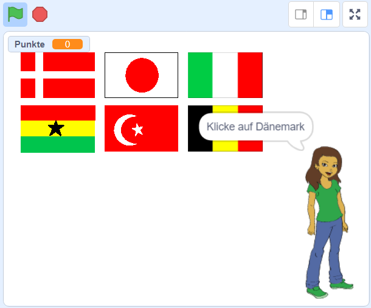

\--- no-print \---

Dies ist die **Scratch 3** Version des Projekts. Es gibt auch eine [Scratch 2 Version des Projekts](https://projects.raspberrypi.org/en/projects/guess-the-flag-scratch2).

\--- /no-print \---

## Einleitung

In diesem Teil erstellst du ein Flaggen-Quiz, um dich und deine Freunde zu testen. Im Quiz werden sechs Flaggen und der Name eines Landes angezeigt, und du musst auf die richtige Flagge des Landes klicken.

### Was du machen wirst

\--- no-print \---

Klicke auf die Flagge des Landes, nach dem du gefragt wirst.

  <iframe allowtransparency="true" width="485" height="402" src="https://scratch.mit.edu/projects/embed/276891625/?autostart=false" frameborder="0" scrolling="no"></iframe>

\--- /no-print \---

\--- print-only \---

\--- /print-only \---

## \--- collapse \---

## title: Was du lernen wirst

+ Wie man eine Nachricht sendet und andere Figuren antworten lässt
+ So wählst du zufällige Elemente aus einer Liste aus

\--- /collapse \---

## \--- collapse \---

## title: Was du brauchen wirst

* * *

### Hardware

+ Ein Computer, auf dem Scratch 3 ausgeführt werden kann

### Software

+ Scratch 3 (entweder [online](http://rpf.io/scratchon){:target="_blank"} oder [offline](http://rpf.io/scratchoff){:target="_blank"})

### Downloads

+ [Offline Starter Projekt](http://rpf.io/p/en/guess-the-flag-go){:target="_blank"}

\--- /collapse \---

## \--- collapse \---

## title: Zusätzliche Hinweise für Pädagogen

\--- no-print \---

Falls du dieses Projekt ausdrucken musst, verwende bitte die [druckerfreundliche Version](https://projects.raspberrypi.org/en/projects/guess-the-flag/print).

\--- /no-print \---

Sie können [die Ressourcen für dieses Projekt hier herunterladen](http://rpf.io/p/en/guess-the-flag-go){: target = "_ blank"}.

Du findest das [abgeschlossene Projekt hier](http://rpf.io/p/en/guess-the-flag-get){:target="_blank"}.

\--- /collapse \---