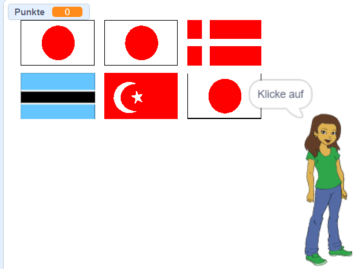

## Starte eine neue Runde

Im Moment gibt es nur eine Runde im Quiz, daher dauert das Quiz nicht lange. Du wirst mehrere Runden einrichten.

\--- task \---

Erstelle eine neue `Nachricht`{:class="block3events"}, die die Nachricht 'Starte die Runde' sendet.


```blocks3
broadcast (start the round v)
```

\--- /task \---

\--- task \---

Füge einen `wenn ich 'Runde starten' erhalte`{:class="block3events"} Block hinzu, und verschiebe dann den gesamten Code von unter dem `wenn grüne Flagge angeklickt wird`{:class="block3events"} Block unter diesen neuen Block.


```blocks3
+ when I receive [start the round v]
set [score v] to [0]
create flag list :: custom
delete (all v) of [chosen flags v]
repeat (6)
    choose random flag :: custom
end
set [correct answer v] to (item (pick random (1) to (length of [chosen flags v])) of [chosen flags v])
clone flags :: custom
+ broadcast (announce country v)
```

\--- /task \---

\--- task \---

Entferne den `Setze Punktzahl auf 0`{:class="block3variables"} Block und platziere ihn zurück unter den `wenn grüne Flagge geklickt`{:class="block3control"} Baustein. Füge dann den neuen `Nachricht`{:class="block3events"} Block unter beiden ein.


```blocks3
when green flag clicked
set [score v] to [0]
broadcast (start the round v)
```

\--- /task \---

\--- task \---

Nach dem Code, der überprüft, ob die Antwort korrekt ist, füge einen weiteren `Nachricht`{:class="block3events"} Baustein hinzu, damit eine neue Runde beginnen kann, sobald eine Frage beantwortet wurde.


```blocks3
when this sprite clicked
if <(costume [name v]) = (correct answer :: variables)> then
    change [score v] by [1]
    say [Correct] for (2) seconds
else
    say [Sorry, that was wrong] for (2) seconds
end
+ broadcast (start the round v)
```

\--- /task \---

\--- task \---

Klicke auf die grüne Flagge, um dein Spiel zu testen. Klicke auf eine der Flaggen, um eine Runde zu spielen. Merkst du, dass die nächste Runde nicht richtig vorbereitet wird?



\--- /task \---

Denn bevor das Spiel eine weitere Runde beginnt, muss das Spiel zuerst die geklonten Flaggen aufräumen.

\--- task \---

Erstelle eine weitere neue `Nachricht`{:class="block3events"} namens 'aufräumen'.


```blocks3
broadcast (clean up v)
```

\--- /task \---

\--- task \---

Setze die Flaggenfigur auf `Lösche diesen Klon `{:class="block3control"} wenn sie die `aufräumen`{:class="block3events"} Nachricht erhält.


```blocks3
when I receive [clean up v]
delete this clone
```

\--- /task \---

\--- task \---

Platziere den `aufräumen`{:class="block3events"} Nachrichten-Block gleich oberhalb wo das Spiel eine neue Runde startet, nachdem eine Antwort gegeben wurde.

```blocks3
when this sprite clicked
create flags list  :: custom
if <(item (costume [number v]) of [flags v]) = (correct answer :: variables)> then
    say [Correct] for (2) seconds
    change [score v] by [1]
else
    say [Sorry, that was wrong] for (2) seconds
end
+ broadcast (clean up v)
broadcast (start the round v)
```

\--- /task \---

\--- task \---

Teste deinen Code erneut und überprüfe, ob du mehrere Runden spielen kannst und dass deine Punktzahl steigt, wenn du die richtigen Antworten abgibst.

\--- /task \---

\--- task \---

Stelle sicher, dass du die `richtige Antwort`{:class="block3variables"} Variable verbirgst, damit der Spieler sie nicht sehen kann!

\--- /task \---