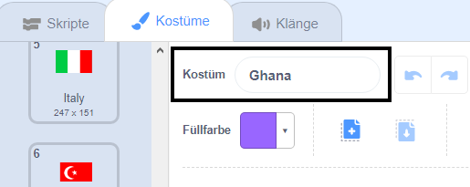

## Zeichne die Flaggen

--- task ---

Öffne das Scratch-Starterprojekt 'Errate die Flagge'.

**Online:** Öffne das Starter-Projekt hier [scratch.mit.edu/projects/411530731](https://scratch.mit.edu/projects/411530731){:target="_blank"}. Wenn du ein Scratch-Konto hast, kannst du auf **Remix** in der oberen rechten Ecke des Online-Editors klicken, um eine Kopie des Projekts zu speichern.

**Offline**: Öffne das [Starter-Projekt](https://rpf.io/p/de-DE/guess-the-flag-go) im Offline-Editor.

Wenn du Scratch herunterladen und auf deinem Rechner installieren möchtest, dann findest du die Datei unter diesem Link: [rpf.io/scratchoff](https://rpf.io/scratchoff){:target="_blank"}.

--- /task ---

Wähle den Kostüme-Tab. Du solltest dort acht Flaggen sehen.

Scrolle zum Ende der Liste der Kostüme, in der sich zwei leere Kostüme befinden. Diese Kostüme sind da, damit du deine eigenen Flaggen hinzufügen kannst.

--- task ---

Klicke auf das Kostüm "Deine Flagge 1" und ändere dessen Namen zu dem Namen eines Landes.

--- /task ---

--- task ---

Zeichne die Flagge dieses Landes. Stelle sicher, dass deine Zeichnung genau die gleiche Größe wie das Flaggenkostüm hat.

Wenn du Ideen brauchst, findest du einige Flaggen auf [der Webseite "Flaggen der Welt"](https://www.countries-ofthe-world.com/flags-of-the-world.html){:target="_blank"}.

--- /task ---

--- task ---

Wiederhole diesen Vorgang für das zweite leere Flaggenkostüm, sodass insgesamt zehn Flaggenkostüme vorhanden sind.

--- /task ---

Hier sind die Flaggen, die als Beispiele im Projekt "Errate die Flagge" dienen. Du kannst jedoch beliebige Flaggen für dein Spiel auswählen.

