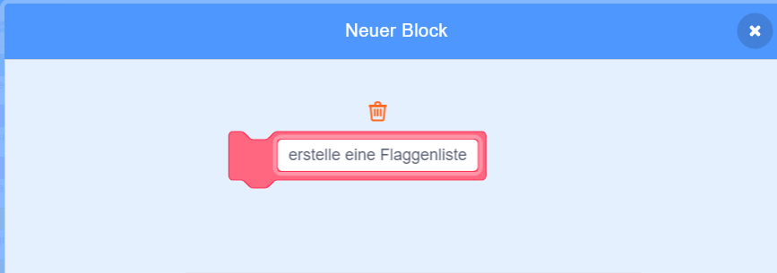

## Erstelle eine Liste der Flaggen

\--- task \---

Klicke auf den Code-Tab. Es gibt eine Liste namens `Flaggen`{: class = "block3variables"}, in dem du die Namen der Länder speicherst, für die dein Spiel Flaggenkostüme hat.

\--- /task \---

\--- task \---

Füge zwei weitere Codeblöcke hinzu, jeweils einen für die beiden von dir erstellten Flaggen. Es gibt also insgesamt zehn Blöcke, die alle zehn Länder zu der `Flaggen`{: class = "block3variables"} Liste hinzufügen.


```blocks3
add [Country] to [flags v]
```

\--- /task \---

\--- task \---

Klicke auf die grüne Flagge und überprüfe, ob die Länder in der Liste angezeigt werden.

\--- /task \---

Wenn du die grüne Flagge mehrmals drückst, werden die Länder erneut zur Liste hinzugefügt, und das Ergebnis ist eine Liste mit 20 statt 10 Ländern.

\--- task \---

Füge zu Beginn des Codes einen Block hinzu, um in der Liste der Länder`alles zu löschen`{:class="block3variables"}, bevor sie hinzugefügt werden. Dadurch wird verhindert, dass die Länder mehr als einmal zur Liste hinzugefügt werden.


```blocks3
when green flag clicked
+ delete (all v) of [flags v]
add [Japan] to [flags v]
add [Belgium] to [flags v]
add [Italy] to [flags v]
add [Turkey] to [flags v]
add [Denmark] to [flags v]
add [Chile] to [flags v]
add [Botswana] to [flags v]
add [Bangladesh] to [flags v]
add [Ghana] to [flags v]
add [Luxembourg] to [flags v]
```

\--- /task \---

Erstelle als nächstes einen eigenen Block. Ein eigener Block ist ein spezieller Block mit einem Namen. Der benutzerdefinierte Block, den du erstellst, lässt dich eine Liste von Flaggen erstellen, die nur diesen einen Block anstelle von vielen Blöcken verwenden.

\--- task \---

Klicke auf **Meine Blöcke** und dann auf **Block erstellen**. Benenne deinen eigenen Block `Erstelle Flaggenliste`{:class="block3myblocks"}.




\--- /task \---

\--- task \---

Verschiebe den gesamten Code von unter dem `wenn Flagge geklickt` {:class="block3events"} Block nach unterhalb der neuen `Erstelle Flaggen-Liste`{:class="block3myblocks"} Block.

```blocks3
define create flag list
delete (all v) of [flags v]
add [Japan] to [flags v]
add [Belgium] to [flags v]
add [Italy] to [flags v]
add [Turkey] to [flags v]
add [Denmark] to [flags v]
add [Chile] to [flags v]
add [Botswana] to [flags v]
add [Bangladesh] to [flags v]
add [Ghana] to [flags v]
add [Luxembourg] to [flags v]
```

\--- /task \---

\--- task \---

Füge unterhalb des `wenn Flagge geklickt`{:class="block3events"} Blocks den neuen `Flaggenliste erstellen`{:class="block3myblocks"} Block hinzu.


```blocks3
when green flag clicked
create flag list :: custom
```

\--- /task \---