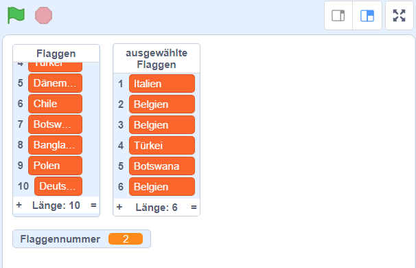

## Wähle zufällige Flaggen aus

Wähle für jede Runde des Quiz sechs zufälligen Flaggen aus der `Flaggen`{:class="block3variables"} Liste als Optionen aus.

--- task ---

Erstelle eine neue Liste mit dem Namen `ausgewählte Flaggen`{:class="block3variables"}. Diese Liste wird die sechs zufälligen Flaggen enthalten.

--- /task ---

--- task ---

Erstelle eine neue Variable namens `Flaggennummer`{:class="block3variables"}.

--- /task ---

--- task ---

Erstelle einen neuen Block und nenne ihn `wähle zufällige Flagge`{:class="block3myblocks"}.


```blocks3
define wähle zufällige Flagge
```

--- /task ---

--- task ---

Füge Code zum neuen Block hinzu, um die `Flaggennummer`{:class="block3variables"} Variable auf eine zufällige Zahl zwischen `1` und der Anzahl der Elemente in der `Flaggen`{:class="block3variables"} Liste zu setzen.


Im Variablen-Tab gibt es einen speziellen Block zum Ermitteln der Anzahl der Elemente in einer Liste.

--- hints ---
 --- hint ---

Setze die `Flagennummer`{:class="block3variables"} Variable auf eine `zufällige Nummer`{:class="block3operators"} zwischen `1` und der `Länge der 'Flaggen' Liste`{:class="block3variables"}.

--- /hint ---

--- hint ---

Hier sind die Codeblöcke die du brauchst:

```blocks3
(length of [Flaggen v])

(pick random (1) to (10))

define wähle zufällige Flagge

set [Flaggennummer v] to []
```

--- /hint ---

--- hint ---

So sollte dein Code aussehen:

```blocks3
define wähle zufällige Flagge
set [Flaggennummer v] to (pick random (1) to (length of [Flaggen v]))
```

--- /hint ---

--- /hints --- --- /task ---

Dieser Block wählt ein Element aus einer Liste nach Nummer aus:

```blocks3
(item (10 v) of [Flaggen v])
```

--- task ---

Kombiniere diesen Block mit der `Flaggennummer`{:class="block3variables"} Variable, um den Text des zufällig ausgewählten Elements der `Flaggen`{:class="block3variables"} Liste zu bekommen. Füge dann den Text in die `ausgewählte Flaggen`{:class="block3variables"} Liste ein. Füge diesen Code deinem Block hinzu:


```blocks3
define wähle zufällige Flagge
set [Flaggennummer v] to (pick random (1) to (length of [Flaggen v]))
+ add (item (Flaggennummer) of [Flaggen v]) to [ausgewählte Flaggen v]
```

--- /task ---

--- task ---

Füge den benutzerdefinierten `wähle zufällige Flagge`{:class="block3myblocks"} Block dem Code hinzu, der ausgeführt wird, nachdem die grüne Flagge angeklickt wurde.


```blocks3
when green flag clicked
erstelle eine Flaggenliste :: custom
+ wähle zufällige Flagge :: custom
```

--- /task ---

--- task ---

Teste, ob dein Code funktioniert, indem du mehrmals auf die grüne Flagge klickst und überprüfst, ob jedes Mal die verschiedenen Länder zu der `ausgewählte Flaggen`{:class="block3variables"} Liste hinzugefügt wurden. (Wenn du die Liste versteckt hast, aktiviere das Kontrollkästchen neben dem Listennamen, um die Liste sichtbar zu machen.)

--- /task ---

Kannst du sehen, dass, wenn du oft auf die grüne Flagge klickst, sich deine `ausgewählte Flaggen`{:class="block3variables"} Liste schnell mit mehr als sechs Elementen füllt?

--- task ---

Füge Blöcke hinzu, um alle Elemente aus der `ausgewählte Flaggen`{:class="block3variables"} Liste zu löschen, bevor du sechs Flaggen für das Quiz auswählst.


```blocks3
when green flag clicked
erstelle eine Flaggenliste :: custom
+ delete (all v) of [ausgewählte Flaggen v]
+ repeat (6)
    wähle zufällige Flagge :: custom
end
```

--- /task ---

--- task ---

Teste deinen Code noch einmal, indem du mehrmals auf die grüne Flagge klickst und überprüfst, ob die `ausgewählte Flaggen` Liste mit jeweils sechs Ländern gefüllt ist.

--- /task ---

Es kann sein, dass du feststellst, dass manchmal das gleiche Land mehrmals zur Liste hinzugefügt wird.



--- task ---

Ändere deinen `wähle zufällige Flagge`{:class="block3myblocks"} Block, damit das gleiche Land nie zweimal zur `ausgewählte Flaggen`{:class="block3variables"} Liste hinzugefügt wird.

Füge einen Block am Ende deines benutzerdefinierten Blockcodes hinzu, um die `Flaggennummer`{:class="block3variables"} aus der `Flaggen`{:class="block3variables"} Liste zu löschen, nachdem sie zur `ausgewählte Flaggen`{:class="block3variables"} Liste hinzugefügt wurde.


```blocks3
define wähle zufällige Flagge
set [Flaggennummer v] to (pick random (1) to (length of [Flaggen v]))
add (item (Flaggennummer) of [Flaggen v]) to [ausgewählte Flaggen v]
+ delete (Flaggennummer) of [Flaggen v]
```

--- /task ---

Wenn du die Listen und Variablen ausblenden möchten, damit sie keinen Platz beanspruchen, gehe zum Abschnitt Daten und deaktiviere die Kontrollkästchen neben den Listennamen oder Variablennamen. Wenn du die Listen und Variablen erneut sehen möchtest, aktiviere einfach die Kontrollkästchen.