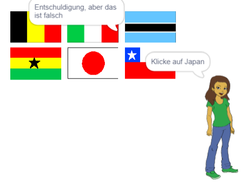

## Überprüfe die Antwort

Deine Figur bittet nun den Spieler, auf die richtige Flagge zu klicken. Dann muss das Spiel prüfen, ob die angeklickte Flagge die richtige Antwort ist.

\--- task \---

Gehe zurück zum Figur-Code und füge dann einen Block hinzu, um einen neuen Abschnitt des Codes zu starten, der ausgeführt wird `wenn diese Figur angeklickt wird`{:class="block3events"}.


\--- /task \---

Dann muss dein Quiz überprüfen, ob der Kostümname der angeklickten Flaggenfigur mit der richtigen Antwort übereinstimmt.

\--- task \---

Füge Code hinzu, um 'Korrekt' zu sagen, wenn der Kostümname der Flagge die gleiche ist wie die `korrekte Antwort`{:class="block3variables"} Variable, oder "Sorry, das war falsch" zu sagen, wenn der Name und die Variable nicht identisch sind.

Du kannst diesen nützlichen Block auch hier verwenden.

```blocks3
(item (10 v) of [flags v])
```

Kombiniere es diesmal mit einem `Kostümnamen`{:class="block3looks"} Block, um den Namen des aktuellen Flaggenfigur-Kostüms abzurufen.


\--- hints \--- \--- hint \---

`Wenn auf diese Figur geklickt wird`{:class="block3events"}, `falls`{:class="block3control"} dieser `Kostümname`{:class="block3looks"} gleich de `korrekte Antwort`{:class="block3variables"} ist, `sage`{:class="block3looks"} 'Richtig' oder `ansonsten`{:class="block3control"} `sage`{:class="block3looks"} 'Entschuldigung, das war falsch'.

\--- /hint \---

\--- hint \---

Hier sind die Codeblöcke die du brauchst:

```blocks3
say [Sorry, that was wrong] for (2) seconds

say [Correct] for (2) seconds

if <> then
else
end

(costume [name v])

<[] = []>

(correct answer)

when this sprite clicked
```

\--- /hint \---

\--- hint \---

So sollte dein Code aussehen:

```blocks3
when this sprite clicked
if <(costume [name v]) = (correct answer :: variables)> then
    say [Correct] for (2) seconds
else
    say [Sorry, that was wrong] for (2) seconds
end
```

\--- /hint \---

\--- /hints \--- \--- /task \---

\--- task \---

Klicke auf grüne Flagge und teste deinen Code zweimal: einmal durch Auswahl der richtigen Flagge und einmal durch Auswahl einer Falschen. Überprüfe, ob die richtige Nachricht angezeigt wird, je nachdem, ob du die richtige oder die falsche Antwort angibst.



\--- /task \---