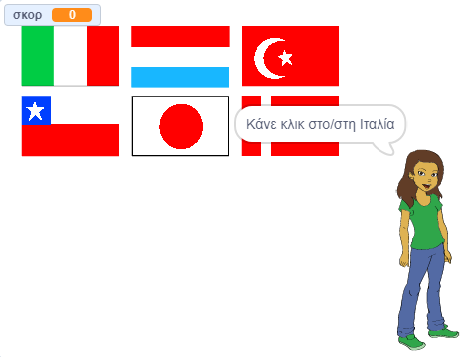

\--- no-print \---

Αυτή είναι η **Scratch 3** έκδοση του έργου. Υπάρχει επίσης η [έκδοση Scratch 2 του έργου](https://projects.raspberrypi.org/en/projects/guess-the-flag-scratch2).

\--- /no-print \---

## Εισαγωγή

Σε αυτόν τον πόρο, θα δημιουργήσεις ένα κουίζ με σημαίες για να δοκιμάσεις τον εαυτό σου και τους φίλους σου. Στο κουίζ, εμφανίζονται έξι σημαίες και το όνομα μιας χώρας και πρέπει να κάνεις κλικ στη σωστή σημαία που ταιριάζει με τη χώρα.

### Τι θα φτιάξεις

\--- no-print \---

Click on the flag of the country for which you are being asked.

  <iframe allowtransparency="true" width="485" height="402" src="https://scratch.mit.edu/projects/embed/276891625/?autostart=false" frameborder="0" scrolling="no"></iframe>

\--- /no-print \---

\--- print-only \---

\--- /print-only \---

## \--- collapse \---

## title: Τι θα μάθεις

+ Πώς να μεταδώσεις ένα μήνυμα και να ανταποκριθούν τα άλλα αντικείμενα
+ Πώς να επιλέξεις τυχαία στοιχεία από μια λίστα

\--- /collapse \---

## \--- collapse \---

## title: Τι θα χρειαστείς

* * *

### Υλικό

+ Ένας υπολογιστής ικανός να τρέχει το Scratch 3

### Λογισμικό

+ Scratch 3 (είτε [online](http://rpf.io/scratchon){:target="_blank"} είτε [offline](http://rpf.io/scratchoff){:target="_blank"})

### Λήψεις

+ [Αρχικό έργο εκτός σύνδεσης](http://rpf.io/p/en/guess-the-flag-go){: target = "_ blank"}

\--- /collapse \---

## \--- collapse \---

## title: Πρόσθετες σημειώσεις για εκπαιδευτικούς

\--- no-print \---

If you need to print this project, please use the [printer-friendly version](https://projects.raspberrypi.org/en/projects/guess-the-flag/print).

\--- /no-print \---

You can [download the resources for this project here](http://rpf.io/p/en/guess-the-flag-go){:target="_blank"}.

You can find the [completed project here](http://rpf.io/p/en/guess-the-flag-get){:target="_blank"}.

\--- /collapse \---