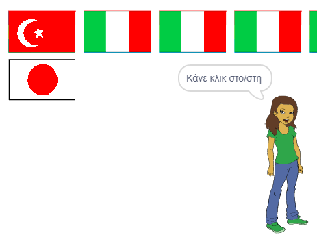

## Ξεκίνησε έναν νέο γύρο

Προς το παρόν υπάρχει μόνο ένας γύρος στο κουίζ, έτσι το κουίζ δεν διαρκεί πολύ. Πρόκειται να δημιουργήσεις πολλαπλούς γύρους.

--- task ---

Δημιουργία νέας `εκπομπής`{:class="block3events"} που στέλνει το μήνυμα 'Έναρξη γύρου'.


```blocks3
broadcast (έναρξη γύρου v)
```

--- /task ---

--- task ---

Πρόσθεσε ένα μπλοκ `όταν λαμβάνω "Έναρξη γύρου"`{:class="block3events"} και στη συνέχεια μετακίνησε όλο τον κώδικα από κάτω από το μπλοκ `όταν γίνει κλικ στην πράσινη σημαία`{:class="block3events"} κάτω από αυτό το νέο μπλοκ.


```blocks3
+ when I receive [έναρξη γύρου v]
set [σκορ v] to [0]
create flag list :: custom
delete (all v) of [επιλεγμένες σημαίες v]
repeat (6) 
  choose random flag :: custom
end
set [σωστή απάντηση v] to (item (pick random (1) εtoώς (length of [chosen flags v])) of [chosen flags v])
clone flags :: custom
+ broadcast (αναγγελία χώρας v)
```

--- /task ---

--- task ---

Αφαίρεσε το μπλοκ `όρισε τη βαθμολογία σε 0`{:class="block3variables"} και τοποθέτησέ την πίσω κάτω από το μπλοκ `όταν γίνει κλικ στην πράσινη σημαία`{:class="block3control"}. Στη συνέχεια, πρόσθεσε το νέο μπλοκ `εκπομπής`{:class="block3events"} κάτω και από τα δύο.


```blocks3
when green flag clicked
set [σκορ v] to [0]
broadcast (έναρξη γύρου v)
```

--- /task ---

--- task ---

Μετά τον κώδικα που ελέγχει αν η απάντηση είναι σωστή, πρόσθεσε άλλο ένα μπλοκ `εκπομπής`{:class="block3events"}, έτσι ώστε ένας νέος γύρος να ξεκινήσει μόλις απαντηθεί η ερώτηση.


```blocks3
when this sprite clicked
if <(costume [όνομα v]) = (σωστή απάντηση :: variables)> then 
  change [σκορ v] by [1]
  say [Σωστά] for (2) seconds
else 
  say [Λυπάμαι, αυτό ήταν λάθος] for (2) seconds
end
+ broadcast (έναρξη γύρου v)
```

--- /task ---

--- task ---

Κάνε κλικ στην πράσινη σημαία για να ελέγξεις τον κώδικα σου. Κάνε κλικ σε μία από τις σημαίες για να παίξεις ένα γύρο. Παρατηρείς ότι ο επόμενος γύρος δεν έχει ρυθμιστεί σωστά;

 --- /task ---

Αυτό συμβαίνει επειδή πριν ξεκινήσει ένας νέος γύρος, το παιχνίδι πρέπει πρώτα να καθαρίσει τις κλωνοποιημένες σημαίες.

--- task ---

Δημιούργησε μια νέα `εκπομπή`{:class="block3events"} με το όνομα 'καθάρισμα'.


```blocks3
broadcast (εκκαθάριση v)
```

--- /task ---

--- task ---

Όρισε το αντικείμενο σημαίας να `διαγράψει αυτό το κλώνο`{:class="block3control"} όταν λαμβάνει την εκπομπή `καθάρισμα`{:class="block3events"}.


```blocks3
when I receive[εκκαθάριση v]
delete this clone
```

--- /task ---

--- task ---

Τοποθέτησε το μπλοκ εκπομπής `καθάρισμα`{:class="block3events"} ακριβώς πάνω από το σημείο που το παιχνίδι ξεκινά ένα νέο γύρο αφού έχει δοθεί μια απάντηση.

```blocks3
when this sprite clicked
create flags list :: custom
if <(item (costume [number v]) of [flags v]) = (σωστή απάντηση :: variables)> then 
  say [Σωστά] for (2) seconds
  change [σκορ v] by [1]
else 
  say [Λυπάμαι, αυτό ήταν λάθος] for (2) seconds
end
+ broadcast (εκκαθάριση v)
broadcast (έναρξη γύρου v)
```

--- /task ---

--- task ---

Δοκίμασε ξανά τον κώδικά σου και έλεγξε ότι μπορείς να παίξεις πολλούς γύρους και ότι η βαθμολογία σου αυξάνεται καθώς δίνεις σωστές απαντήσεις.

--- /task ---

--- task ---

Βεβαιώσου ότι έχεις κρύψει τη μεταβλητή `σωστή απάντηση`{:class="block3variables"} έτσι ώστε ο παίκτης να μην μπορεί να τη δει! --- /task ---