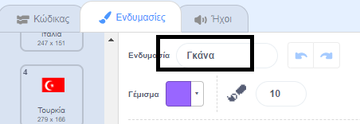
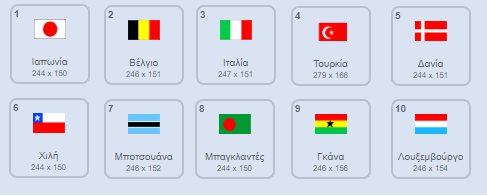

## Σχεδίασε τις σημαίες

--- task --- Άνοιξε το αρχικό έργο Scratch 'Μάντεψε τη σημαία'.

**Online:** άνοιξε το αρχικό έργο στο [rpf.io/guess-the-flag-on](http://rpf.io/guess-the-flag-on){:target="_blank"}. Αν διαθέτεις λογαριασμό Scratch, μπορείς να πατήσεις το **Remix** στην πάνω-δεξιά γωνία του επεξεργαστή για να αποθηκεύσεις ένα αντίγραφο του έργου.

**Offline**: άνοιξε το [αρχικό έργο](http://rpf.io/p/el-GR/guess-the-flag-go) στον επεξεργαστή εκτός σύνδεσης.

Αν χρειαστεί να κατεβάσεις και να εγκαταστήσεις τον offline editor για το Scratch, μπορείς να το βρεις στο [rpf.io/scratchoff](http://rpf.io/scratchoff){:target="_blank"}.

--- /task ---

Επίλεξε την καρτέλα Ενδυμασίες. Θα δεις οκτώ σημαίες εκεί.

Πήγαινε στο κάτω μέρος της λίστας ενδυμασιών, όπου υπάρχουν δύο κενές ενδυμασίες. Αυτές οι ενδυμασίες είναι εκεί, ώστε να μπορείς να προσθέσεις τις δικές σου σημαίες.

--- task --- Κάνε κλικ στην ενδυμασία 'Your flag 1' και άλλαξε το όνομά της στο όνομα μιας χώρας.

 --- /task ---

--- task --- Σχεδίασε τη σημαία της χώρας. Βεβαιώσου ότι το σχέδιό σου είναι ακριβώς το ίδιο μέγεθος με την ενδυμασία σημαίας.

Εάν δεν σου έρχεται κάποια ιδέα, μπορείς να βρεις μερικές σημαίες σε [αυτή την ιστοσελίδα «Σημαίες του κόσμου»](https://www.countries-ofthe-world.com/flags-of-the-world.html){:target="_blank"}.

--- /task ---

--- task --- Επανάλαβε αυτή τη διαδικασία για τη δεύτερη κενή ενδυμασία, έτσι ώστε να υπάρχουν δέκα ενδυμασίες σημαίας συνολικά. --- /task ---

Αυτές είναι οι σημαίες που λειτουργούν ως παραδείγματα στο έργο «Μάντεψε τη σημαία», αλλά μπορείς να επιλέξεις όποιες σημαίες θέλεις για το παιχνίδι σου.

