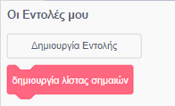

## Δημιούργησε μια λίστα με σημαίες

--- task --- Κάνε κλικ στην καρτέλα κώδικα. Υπάρχει μια λίστα που ονομάζεται `σημαίες`{:class="block3variables"}, όπου αποθηκεύεις τα ονόματα των χωρών στις οποίες έχει το παιχνίδι σου ενδυμασίες σημαίας. --- /task ---

--- task --- Πρόσθεσε δύο ακόμη μπλοκ κώδικα, κάθε ένα για τις άλλες δύο σημαίες που δημιούργησες, έτσι ώστε τελικά να υπάρχουν δέκα μπλοκ που προσθέτουν και τις δέκα χώρες στη λίστα των `σημαίων`{:class="block3variables"}.


```blocks3
add [Χώρα] to [σημαίες v]
```

--- /task ---

--- task ---
Κάνε κλικ στην πράσινη σημαία και έλεγξε ότι οι χώρες εμφανίζονται στη λίστα.
--- /task ---

Εάν πιέσεις την πράσινη σημαία περισσότερες από μία φορές, οι χώρες θα προστεθούν ξανά στη λίστα και το αποτέλεσμα θα είναι μια λίστα με 20 χώρες αντί για 10.

--- task ---
Στην αρχή του κώδικα, πρόσθεσε ένα μπλοκ για να `διαγράψεις όλες τις`{:class="block3variables"} τις χώρες στη λίστα πριν από την προσθήκη τους. Αυτό θα σταματήσει την προσθήκη χωρών στη λίστα περισσότερες από μία φορές.


```blocks3
when green flag clicked
+ delete (all v) of [flags v]
add [Ιαπωνία] to [flags v]
add [Βέλγιο] to [flags v]
add [Ιταλία] to [flags v]
add [Τουρκία] to [flags v]
add [Δανία] to [flags v]
add [Χιλή] to [flags v]
add [Μποτσουάνα] to [flags v]
add [Μπαγκλαντές] to [flags v]
add [Γκάνα] to [flags v]
add [Λουξεμβούργο] to [flags v]
```

--- /task ---

Στη συνέχεια, δημιούργησε ένα προσαρμοσμένο μπλοκ. Ένα προσαρμοσμένο μπλοκ είναι ένα ειδικό μπλοκ με ένα όνομα. Το προσαρμοσμένο μπλοκ που θα δημιουργήσεις θα σου επιτρέψει να δημιουργήσεις μια λίστα με σημαίες χρησιμοποιώντας μόνο αυτό το μπλοκ αντί για πολλά μπλοκ.

--- task ---

Κάνε κλικ στα **Μπλοκ μου** και έπειτα στο **Κάνε ένα μπλοκ**. Ονόμασε το προσαρμοσμένο σου μπλοκ `δημιουργία λίστα σημαίων`{:class="block3myblocks"}.


 --- /task ---

--- task ---

Σύρε ολόκληρο τον κώδικα από κάτω από το μπλοκ `όταν γίνει κλικ στη σημαία`{:class="block3events"} κάτω από το νέο μπλοκ `δημιουργία λίστας σημαίων`{:class="block3myblocks"}.

```blocks3
define create flag list
+ delete (all v) of [flags v]
add [Ιαπωνία] to [flags v]
add [Βέλγιο] to [flags v]
add [Ιταλία] to [flags v]
add [Τουρκία] to [flags v]
add [Δανία] to [flags v]
add [Χιλή] to [flags v]
add [Μποτσουάνα] to [flags v]
add [Μπαγκλαντές] to [flags v]
add [Γκάνα] to [flags v]
add [Λουξεμβούργο] to [flags v]
```

--- /task ---

--- task ---

Κάτω από το μπλοκ `όταν γίνει κλικ στη σημαία`{:class="block3events"}, πρόσθεσε το νέο μπλοκ `δημιουργία λίστας σημαίων`{:class="block3myblocks"}.


```blocks3
when green flag clicked
create flag list :: custom
```

--- /task ---