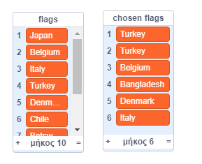

## Επίλεξε τυχαίες σημαίες

Για κάθε γύρο του κουίζ, επίλεξε έξι τυχαίες σημαίες από τη λίστα `σημαίες`{:class="block3variables"} για να είναι οι επιλογές για την απάντηση.

--- task --- Δημιουργία άλλης λίστας που ονομάζεται `επιλεγμένες σημαίες`{:class="block3variables"}. Αυτή η λίστα θα αποθηκεύσει τις έξι τυχαίες σημαίες. --- /task ---

--- task --- Δημιούργησε μια μεταβλητή που ονομάζεται `αριθμός σημαίας`{:class="block3variables"}. --- /task ---

--- task --- Δημιούργησε ένα προσαρμοσμένο μπλοκ και ονόμασέ το `επιλογή τυχαίας σημαίας`{:class="block3myblocks"}.


```blocks3
ορισμός choose random flag
```

--- /task ---

--- task --- Πρόσθεσε τον κώδικα στο προσαρμοσμένο μπλοκ για να ορίσεις τη μεταβλητή `σημαία`{:class="block3variables"} σε έναν τυχαίο αριθμό μεταξύ `1` και τον αριθμό των αντικειμένων στη λίστα των `σημαίων`{class="block3variables"}.


Υπάρχει ένα ειδικό μπλοκ στην καρτέλα "Μεταβλητές" για την εύρεση του αριθμού των στοιχείων σε μια λίστα.

--- hints ---
 --- hint --- Όρισε τη μεταβλητή `σημαία`{:class="block3variables"} σε έναν `τυχαίο αριθμό`{:class="block3operators"} μεταξύ `1` και το μήκος `της λίστας "σημαίες"`{:class="block3variables"}.
--- /hint ---


--- hint --- Εδώ είναι τα μπλοκ κώδικα που χρειάζεσαι:

```blocks3
(μήκος λίστας [flags v])

(επίλεξε τυχαίο (1) εώς (10))

ορισμός choose random flag

όρισε [flag number v] σε []
```

--- /hint ---

--- hint --- Αυτός είναι ο κώδικας με τον οποίον θα πρέπει να μοιάζει ο δικός σου:

```blocks3
ορισμός choose random flag
όρισε [flag number v] σε (επίλεξε τυχαίο (1) εώς (μήκος λίστας [flags v]))
```

--- /hint ---

--- /hints --- --- /task ---

Αυτό το μπλοκ επιλέγει ένα στοιχείο από μια λίστα με τον αριθμό:

```blocks3
(στοιχείο (10 v) λίστας [flags v])
```

--- task --- Συνδύασε αυτό το μπλοκ με τη μεταβλητή `αριθμός σημαίας`{:class="block3variables"} για να πάρεις το κείμενο του τυχαία επιλεγμένου στοιχείου από τη λίστα `σημαίες`{:class="block3variables"}. Στη συνέχεια, πρόσθεσε το κείμενο του στοιχείου στη λίστα `επιλεγμένων σημαίων`{:class="block3variables"}. Πρόσθεσε αυτόν τον κώδικα στο προσαρμοσμένο σου μπλοκ:


```blocks3
ορισμός choose random flag
όρισε [flag number v] σε (επίλεξε τυχαίο (1) εώς (μήκος λίστας [flags v]))
+ πρόσθεσε (στοιχείο (flag number) λίστας [flags v]) στη λίστα [chosen flags v]
```

--- /task ---

--- task --- Πρόσθεσε το προσαρμοσμένο μπλοκ `επιλογή τυχαίας σημαίας`{:class="block3myblocks"} στον κώδικα που εκτελείται μετά την ενεργοποίηση της πράσινης σημαίας.


```blocks3
Όταν στην πράσινη σημαία γίνει κλικ
create flag list :: custom
+ choose random flag :: custom
```

--- /task ---

--- task ---

Δοκίμασε ότι ο κώδικας σου λειτουργεί κάνοντας κλικ στην πράσινη σημαία αρκετές φορές και ελέγχοντας ότι διαφορετικές χώρες προστίθενται στη λίστα `επιλεγμένων σημαίων`{:class="block3variables"} κάθε φορά. (Εάν έχεις αποκρύψει τη λίστα, επίλεξε το κουτί δίπλα στο κουτί της λίστας για να καταστήσεις την λίστα ορατή.)

--- /task ---

Μπορείς να δεις ότι, αν κάνεις κλικ στη πράσινη σημαία πολλές φορές, η λίστα σου με τις `επιλεγμένες σημαίες`{:class="block3variables"} γρήγορα γεμίζει με περισσότερα από έξι στοιχεία;

--- task --- Πρόσθεσε μπλοκ για να διαγράψεις όλα τα στοιχεία από τη λίστα `επιλεγμένων σημαίων`{:class="block3variables"} πριν από την επιλογή των έξι σημαίων για το κουίζ.


```blocks3
Όταν στην πράσινη σημαία γίνει κλικ
create flag list :: custom
+ διάγραψε (all v) από λίστα [chosen flags v]
+ επανάλαβε (6) 
  choose random flag :: custom
end
```

--- /task ---

--- task --- Δοκίμασε τον κώδικά σου και πάλι πατώντας την πράσινη σημαία αρκετές φορές και έλεγξε ότι η λίστα με τις `επιλεγμένες σημαίες` έχει έξι χώρες κάθε φορά. --- /task ---

Ίσως παρατηρήσεις ότι μερικές φορές η ίδια χώρα προστίθεται στη λίστα περισσότερες από μία φορές.



--- task --- Άλλαξε το μπλοκ `επίλεξε τυχαία σημαία`{:class="block3myblocks"} έτσι ώστε η ίδια χώρα να μην προστεθεί ποτέ δύο φορές στη λίστα `επιλεγμένων σημαίων`{:class="block3variables"}.

Πρόσθεσε ένα μπλοκ στο τέλος του προσαρμοσμένου μπλοκ κώδικα για να διαγράψεις τον `αριθμό σημαίας`{:class="block3variables"} από τη λίστα των `σημαιών`{:class="block3variables"} αφού προστεθεί στη λίστα `επιλεγμένων σημαιών`{:class="block3variables"}.


```blocks3
ορισμός choose random flag
όρισε [flag number v] σε (επίλεξε τυχαίο (1) εώς (μήκος λίστας [flags v]))
πρόσθεσε (στοιχείο (flag number) λίστας [flags v]) στη λίστα [chosen flags v]
+ διάγραψε (flag number) από λίστα [flags v]
```

--- /task ---

Εάν θέλεις να αποκρύψεις τις λίστες και τις μεταβλητές έτσι ώστε να μην καταλαμβάνουν χώρο στο σκηνικό, μπορείς να μεταβείς στην ενότητα Δεδομένα και να αποεπιλέξεις τα κουτιά δίπλα στα ονόματα λίστας ή τα ονόματα μεταβλητών. Εάν θέλεις να εμφανίσεις ξανά τις λίστες και τις μεταβλητές, απλώς επίλεξε τα κουτιά.