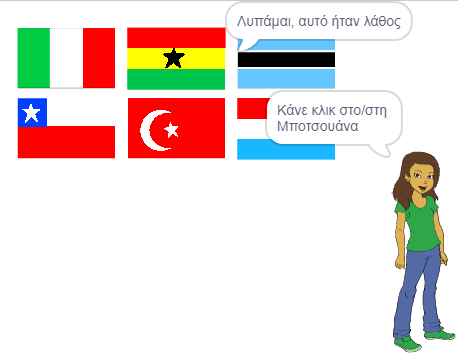

## Έλεγξε την απάντηση

Ο χαρακτήρας σου ζητά τώρα από τον παίκτη να κάνει κλικ στη σωστή σημαία. Στη συνέχεια, το παιχνίδι πρέπει να ελέγξει αν η σημαία στην οποία έγινε κλικ είναι η σωστή απάντηση.

--- task --- Επίστρεψε στον κώδικα του αντικείμενου σημαίας και πρόσθεσε ένα μπλοκ για να ξεκινήσεις μια νέα ενότητα κώδικα που θα τρέξει `όταν πατηθεί αυτό το αντικείμενο`{:class="block3events"}.

 --- /task ---

Στη συνέχεια, το κουίζ σου πρέπει να ελέγξει εάν το όνομα ενδυμασίας του αντικειμένου σημαίας στο οποίο έγινε κλικ έχει την ίδια τιμή με τη σωστή απάντηση.

--- task --- Πρόσθεσε κώδικα για να πει «σωστά» εάν το όνομα ενδυμασίας του αντικειμένου σημαίας είναι το ίδιο με τη μεταβλητή`σωστή απάντηση`{:class="block3variables"}, ή να πει «Συγγνώμη, αυτό ήταν λάθος" εάν το όνομα και η μεταβλητή δεν είναι τα ίδια.

Μπορείς επίσης να χρησιμοποιήσεις αυτό το χρήσιμο μπλοκ.

```blocks3
(στοιχείο (10 v) λίστας [flags v])
```

Αυτή τη φορά, συνδύασέ την με ένα μπλοκ `όνομα ενδυμασίας`{:class="block3looks"} για να πάρεις το όνομα της τρέχουσας ενδυμασίας του αντικειμένου σημαίας.


--- hints ---
 --- hint --- `Όταν γίνει κλικ σε αυτόν τον χαρακτήρα`{:class="block3events"}, `αν`{:class="block3control"} αυτό το `όνομα ενδυμασίας`{:class="block3looks"} ισούται με τη `σωστή απάντηση`{:class="block3variables"}, `πες`{:class="block3looks"} 'Σωστά', `αλλιώς`{:class="block3control"} `πες`{:class="block3looks"} 'Λυπάμαι, αυτό ήταν λάθος'.
--- /hint ---


--- hint --- Εδώ είναι τα μπλοκ κωδικα που χρειάζεσαι:

```blocks3
πες [Λυπάμαι, αυτό ήταν λάθος] για (2) δευτερόλεπτα

πες [Σωστά] για (2) δευτερόλεπτα

εάν <> τότε 
  
αλλιώς
end

(ενδυμασία [όνομα v])

<[] = []>

(σωστή απάντηση)

όταν γίνει κλικ σε αυτό το αντικείμενο
```

--- /hint ---

--- hint --- Αυτός είναι ο κώδικας με τον οποίον θα πρέπει να μοιάζει ο δικός σου:

```blocks3
όταν γίνει κλικ σε αυτό το αντικείμενο
εάν <(ενδυμασία [όνομα v]) = (σωστή απάντηση :: variables)> τότε 
  πες [Σωστά] για (2) δευτερόλεπτα
αλλιώς 
  πες [Λυπάμαι, αυτό ήταν λάθος] για (2) δευτερόλεπτα
end
```

--- /hint ---

--- /hints --- --- /task ---

--- task --- Πάτησε την πράσινη σημαία και δοκίμασε τον κώδικά σου δύο φορές: μία φορά επιλέγοντας τη σωστή σημαία και μία φορά επιλέγοντας μία λανθασμένη. Έλεγξε ότι εμφανίζεται το σωστό μήνυμα ανάλογα με το αν δίνεις τη σωστή ή τη λανθασμένη απάντηση.

 --- /task ---