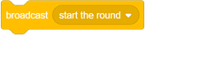
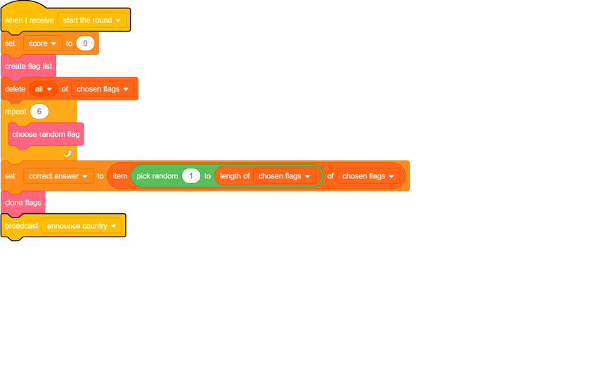
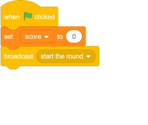
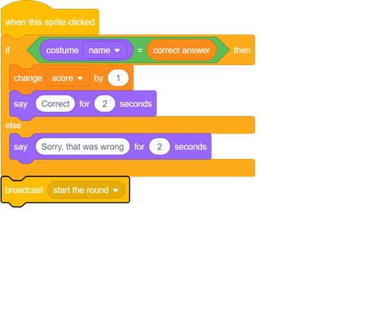
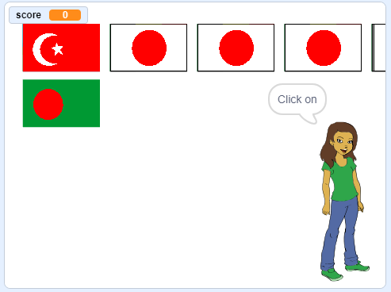
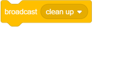

## Start a new round

At the moment there is only one round in the quiz, so the quiz doesn't last long. You are going to set up multiple rounds.

--- task ---
Create a new `broadcast`{:class="block3events"} that sends the message 'Start the round'.

--- /task ---

--- task ---
Add a `when I receive 'Start the round'`{:class="block3events"} block, and then move all of the code from below the `when green flag clicked`{:class="block3events"} block to below this new block.

--- /task ---

--- task ---
Remove the `set score to 0`{:class="block3variables"} block and place it back below the `when green flag clicked`{:class="block3control"} block. Then add the new `broadcast`{:class="block3events"} block below both of them.

--- /task ---

--- task ---
After the code that checks whether the answer is correct, add another `broadcast`{:class="block3events"} block so that a new round can start once a question is answered.

--- /task ---

--- task ---
Click the green flag to test your code. Click on one of the flags to play a round. Do you notice that the next round does not get set up properly?

--- /task ---

This is because before the game starts another round, the game needs to first clear up the cloned flags.

--- task ---
Create another new `broadcast`{:class="block3events"} called 'clean up'.

--- /task ---

--- task ---
Set the Flag sprite to `delete this clone`{:class="block3control"} when it receives the `clean up`{:class="block3events"} broadcast.

--- /task ---

--- task ---
Place the `clean up`{:class="block3events"} broadcast block just above where the game starts a new round after an answer has been given.

--- /task ---

--- task ---
Test your code again and check that you can play multiple rounds, and that your score increases as you get answers correct.
--- /task ---

--- task ---
Make sure you hide the `correct answer`{:class="block3variables"} variable so the player can't see it!
--- /task ---
