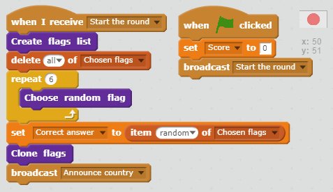
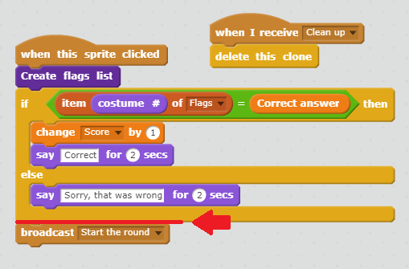

## Start a new round

At the moment we only have one round to play, so the game doesn't last long. Let's set up multiple rounds.

+ Create a new broadcast called **Start the round**

+ Move all of the code which previously happened when the green flag was clicked, to happen **When I receive Start the round**.

+ Remove the **Set score to 0** block and place it back with the **When green flag clicked** block, followed by the new broadcast block you just created

+ After the code where you check the answer, add another copy of the broadcast block to start a new round after an answer has been given

+ Press the green flag to test your code. Click on a flag to play a round. You will notice that the next round does not get set up properly.

This is because we need to clear up the cloned flags we created before beginning another round.

+ Create another new broadcast called **Clean up**

+ Set the flag sprite to **Delete this clone** when it receives the "Clean up" broadcast

+ Place the block that broadcasts "Clean up" just before you begin a new round after an answer has been given

+ Test your code again and check that you can play multiple rounds successfully and that your score continues to increase as you get correct answers.
