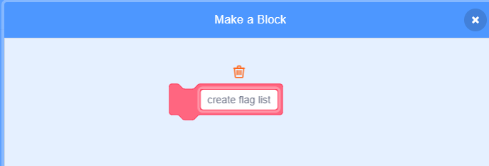

## Create a list of flags

--- task ---
Click on the Scripts tab. You will see that a list called `flags`{:class="blockdata"} has been created for you. This will be where we store the names of all of the countries whose flags we have included in the game.
--- /task ---

--- task ---
Add two more blocks, one each for the other two flags you created, so you end up with a total of ten blocks adding all ten countries to your `flags`{:class="blockdata"} list.


```blocks
add [Country] to [flags v]
```
--- /task ---

--- task ---
Click the green flag and check that the countries appear in the list.
--- /task ---

If you press the green flag more than once, you will see that the countries are added to the list again, so you end up with a list of 20 countries and not 10.

--- task ---
Add a block to the start of the code which will `delete all`{:class="blockdata"} of the countries in the list before adding them. This will stop the countries from being added to the list more than once.


```blocks
when green flag clicked
+ delete (all v) of [flags v]
add [Japan] to [flags v]
add [Belgium] to [flags v]
add [Italy] to [flags v]
...
```

--- /task ---

Let's make a custom block. This is a special block with a name, and we will be able to create a list of flags using only this one block, instead of having to use lots of blocks.

--- task ---
Click on 'More Blocks' and then 'Make a Block'. Call your custom block `create flag list`{:class="blockmoreblocks"}



--- /task ---

--- task ---
Drag all of the code so that it is underneath the new `create flag list`{:class="blockmoreblocks"} block instead of the `when flag clicked`{:class="blockevents"} block.

```blocks
define create flag list
delete (all v) of [flags v]
add [Japan] to [flags v]
add [Belgium] to [flags v]
add [Italy] to [flags v]
add [Turkey] to [flags v]
add [Denmark] to [flags v]
add [Chili] to [flags v]
add [Botswana] to [flags v]
add [Bangladesh] to [flags v]
add [mart o land] to [flags v]
add [green] to [flags v]
```

--- /task ---

--- task ---
Underneath the `when flag clicked`{:class="blockevents"} block, add the new block.


```blocks
when green flag clicked
create flag list :: custom
...
```

--- /task ---  
