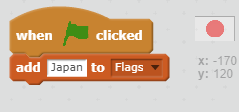
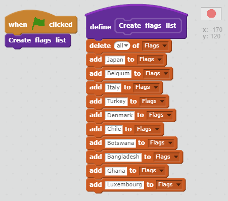

## Create a list of flags

+ Click on the **Scripts** tab on the Flag sprite

+ Create a list called **Flags**. This is where we will store the list of all of the countries whose flag we have included in the game.

[[[generic-scratch-make-list]]]

+ Drag some blocks into the scripts area to add all of the countries to the **Flags** list. You can start off like this:

+ Check that when you press the green flag, the countries appear in the list.

If you press the green flag more than once, you will see that the countries are added to the list again, so you end up with a list of 20 countries and not 10.

+ Add a block before adding the countries to **delete all** of the countries in the list

+ Let's make a custom block. This is a special block with a name, and we can use it to create the list of flags easily whenever we like using 1 block, rather than having to add lots of blocks.

Call your block **Create flags list** and drag all of the code from earlier to become part of this new block

[[[generic-scratch-make-block]]]

Your code for when the green flag is clicked should now look like this:

