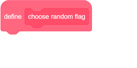
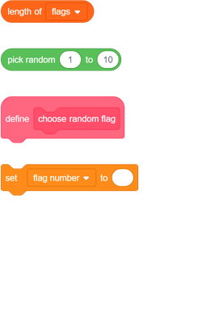
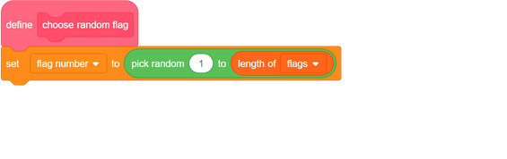
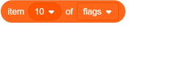
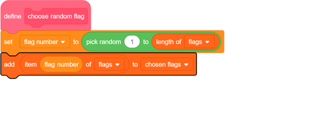
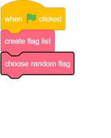
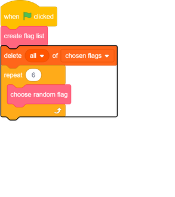
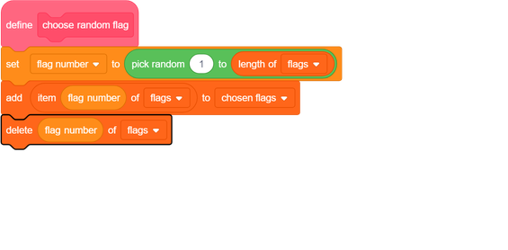

## Choose random flags

For each round of the quiz, choose six random flags from the `flags`{:class="block3variables"} list to be the options.

--- task ---
Create another list called `chosen flags`{:class="block3variables"}. This list will store the six random flags.
--- /task ---

--- task ---
Create a variable called `flag number`{:class="block3variables"}.
--- /task ---

--- task ---
Create a custom block and call it `choose random flag`{:class="block3myblocks"}.

--- /task ---

--- task ---
Add code to the custom block to set the `flag number`{:class="block3variables"} variable to a random number between `1` and the number of items in the `flags`{:class="block3variables"} list.

There is a special block in the Variables tab for finding the number of items in a list.

--- hints ---
--- hint ---
Set the `flag number`{:class="block3variables"} variable to a `random number`{:class="block3operators"} between `1` and the `length of the 'flags' list`{:class="block3variables"}.
--- /hint ---

--- hint ---
Here are the code blocks you need:

--- /hint ---

--- hint ---
This is what your code should look like:

--- /hint ---

--- /hints ---
--- /task ---

This block selects an item from a list by number:

--- task ---
Combine this block with the `flag number`{:class="block3variables"} variable to get the text of the randomly chosen item from the `flags`{:class="block3variables"} list. Then add the item text into the `chosen flags`{:class="block3variables"} list. Add this code to your custom block:

--- /task ---

--- task ---
Add the custom `choose random flag`{:class="block3myblocks"} block to the code that runs after the green flag is clicked.

--- /task ---

--- task ---

Test that your code works by clicking the green flag several times and checking that different countries are added to the `chosen flags`{:class="block3variables"} list every time. (If you have hidden the list, tick the box next to the list name to make the list visible.)

--- /task ---

Can you see that, if you click the green flag lots of times, your `chosen flags`{:class="block3variables"} list quickly fills up with more than six items?

--- task ---
Add blocks to delete all the items from the `chosen flags`{:class="block3variables"} list before choosing six flags for the quiz.

--- /task ---

--- task ---
Test your code again by clicking the green flag several times and checking that the `chosen flags` list is filled with six countries each time.
--- /task ---

You might notice that sometimes the same country gets added to the list more than once.

--- task ---
Change your `choose random flag`{:class="block3myblocks"} block so that the same country never gets added twice to the `chosen flags`{:class="block3variables"} list.

Add a block to the end of your custom block code to delete the `flag number`{:class="block3variables"} from the `flags`{:class="block3variables"} list after it has been added to the `chosen flags`{:class="block3variables"} list.

--- /task ---

If you want to hide the lists and variables so that they don't take up space on the Stage, go to the Data section and unselect the boxes next to the list names or variable names. If you want to show the lists and variables again, just select the boxes.
