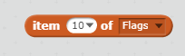

## Choose a correct answer

Now that we have a list containing six chosen flags, let's choose which of them will be the correct answer this time.

+ Create a new variable called `Correct answer`.

+ After you have chosen the six flags, set the `Correct answer` variable to be a random item from the `Chosen flags` list.

Add your code like this:

You can use the same block we used before:

However, you will need to change the drop-down menu to choose a random item instead of a specific item number.
