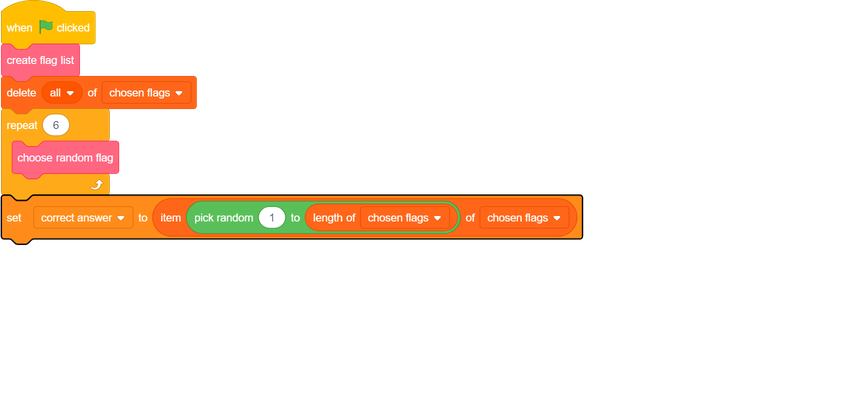

## Choose a correct answer

Now that you have a list containing six chosen flags, choose which of them will be the correct answer this time.

--- task ---
Create a new variable called `correct answer`{:class="block3variables"}.
--- /task ---

--- task ---
After the six flags are chosen, set the `correct answer`{:class="block3variables"} variable to be a random item from the `chosen flags`{:class="block3variables"} list.

--- /task ---
