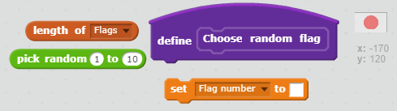
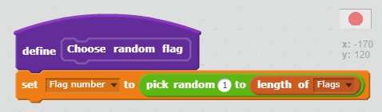
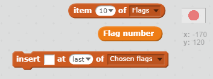
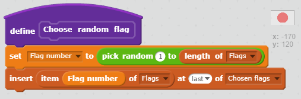
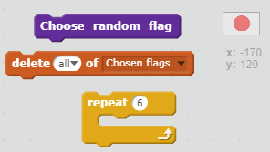
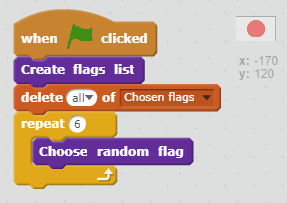
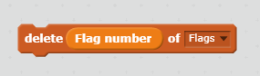

## Choose random flags

We need to select six random flags from the flags list to be the possible choices in the game.

+ Create another list called **Chosen flags**. This list will store the six chosen flags.

+ Now create a variable called **Flag number**

[[[generic-scratch-add-variable]]]

+ Add a custom block, just like you did for the 'Create flags list' custom block. Call this new custom block **Choose random flag**.

+ Add code to this block to set the **Flag number** variable to a random number between 1 and the number of items in the 'Flags' list. You will find that there is a special block in the 'Data' tab for finding the number of items in a list.

--- hints ---
--- hint ---
Set the **Flag number** variable to
a random number between 1 and
the **length of the 'Flags' list**
--- /hint ---

--- hint ---
Here are the code blocks you'll need:

--- /hint ---

--- hint ---
This is what your code should look like:

--- /hint ---

--- /hints ---

This block selects an item from a list, by number:

+ Combine this block with the **Flag number** variable to get the *text* of the randomly chosen item in the 'Flags' list. Insert the item text into the **Chosen flags** list. Add this code to your custom block.

--- hints ---
--- hint ---
**Insert** the
...text from the **Item** at the **Flag number** from the Flags list
...into the Chosen flags list
--- /hint ---

--- hint ---
Here are the code blocks you'll need:

--- /hint ---

--- hint ---
This is what your code should look like:

--- /hint ---

--- /hints ---

+ Add your custom block to the code that will be run when the green flag is clicked

+ Test that your code works by clicking the green flag several times and checking that different countries are added to the **Chosen flags** list. (Tick the box next to the list to make it visible if you have hidden it.)

You will notice that if you press the green flag lots of times, your 'Chosen flags' list fills up quickly with more than 6 choices.

+ Add blocks to delete all of the countries from the 'Chosen flags' list before choosing 6 flags for the game.

--- hints ---
--- hint ---
**Delete all** of the chosen flags
**Repeat** choosing a **random flag** 6 times
--- /hint ---

--- hint ---
Here are the code blocks you'll need:

--- /hint ---

--- hint ---
This is what your code should look like:

--- /hint ---

--- /hints ---

+ Test your code by clicking the green flag and checking that the 'Chosen flags' list is filled with 6 countries each time.

You might notice that sometimes the same country gets chosen more than once in the list.

+ Add a block to the end of your custom block code to delete the randomly chosen 'Flag number' from the 'Flags' list after this item has been added to the 'Chosen flags' list. This will stop it from being chosen again.

