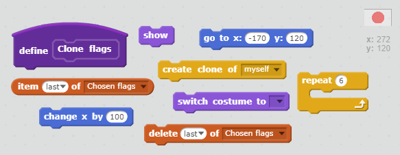
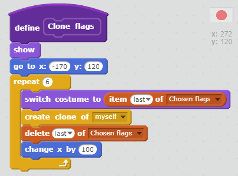
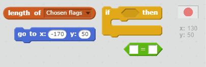
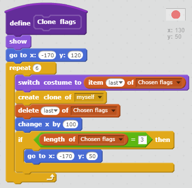

## Show the flags

The player needs to be able to see the six possible flags to make their choice in the game, so we need to display the pictures of the flags that were selected to be in the `Chosen flags` list.

+ Create another custom block, this time called `Clone flags`.

We will clone the Flag sprite six times, once for each flag that will be displayed. We would like the first flag to be displayed in the top left-hand corner of the page.

+ Move your mouse to a point near the top left-hand corner of the stage. This will be where the centre of your first flag sprite appears, so don't go too close to the edge. Note down the coordinates of the point you chose.

[[[generic-scratch-coordinates]]]

+ Add a `show` block to make the sprite visible, and a `go to` block to your custom block to tell the flag sprite to begin at these coordinates.

[[[generic-scratch-set-coordinates]]]

+ Now add a loop that repeats six times to display the flags.

+ Add code inside the loop to switch the costume to the last flag in the `Chosen flags` list and to clone the sprite. Then, delete the last flag from the list and add `110` to the `x` coordinate to move along ready to place the next flag.

--- hints ---
--- hint ---
`Repeat` six times:
`Switch costume` to the `last item in chosen flags`.
`Clone the sprite`.
`Delete` the last item in chosen flags.
`Move right 110`.
--- /hint ---

--- hint ---
Here are the code blocks you'll need:

--- /hint ---

--- hint ---
This is what your code should look like:

--- /hint ---

--- /hints ---

+ Run your code by pressing the green flag. You will notice that the different flags do appear, but they go off the end of the stage.

Let's make two rows of three flags.

+ Add some code inside the loop to move down a row if there are three flags left in the `Chosen flags` list.

You can move down a row by using another `go to` block and keeping the `x` coordinate the same as the starting point, but decreasing the `y` coordinate to move downwards.

--- hints ---
--- hint ---
`If` the `length of chosen flags` is 3, `go to` the same `x` coordinate but a smaller `y` coordinate.
--- /hint ---

--- hint ---
Here are the code blocks you'll need:

--- /hint ---

--- hint ---
This is what your code should look like:

--- /hint ---

--- /hints ---

+ Press the green flag and check that you now have flags in two rows.

It looks like the last flag is displaying twice. In actual fact what is happening is that the original flag sprite is still visible at the end.

+ Add a `hide` block at the end of your custom block's code to hide the original sprite.

+ Add your new `clone flags` block to the end of the code that runs when the green flag is clicked.

### Challenge
+ Can you make the flag sprites appear one by one?
+ Can you make each flag make a sound (a pop, for example) when it appears?

[[[generic-scratch-sound-from-library]]]
