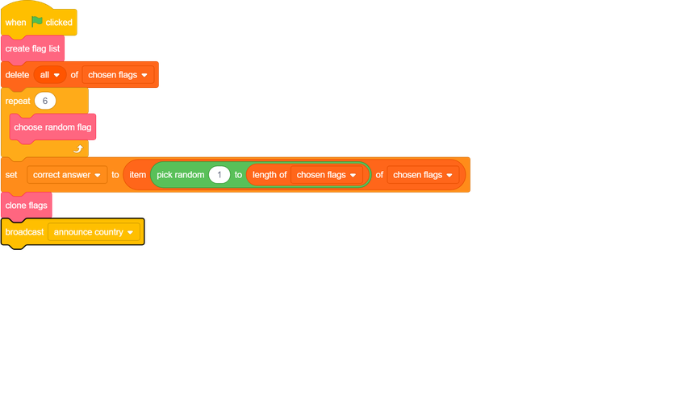
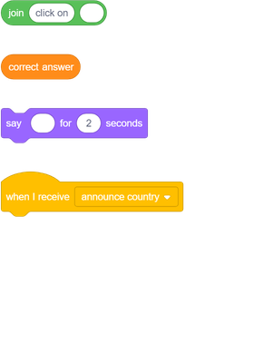
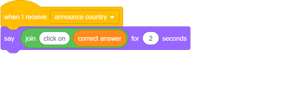

## Ask the question

Let's ask the player to name the flag for a particular country.

--- task ---
In the flag sprite, `broadcast the message`{:class="block3events"} 'announce country' immediately after the block that clones the flags.

[[[generic-scratch3-broadcast-message]]]
--- /task ---

--- task ---
Add a new sprite of your choice to be your quiz master. The quiz master in the example is the sprite called Abby.

--- /task ---

--- task ---
Add some code to the quiz master sprite so that, when the sprite receives the `announce country`{:class="block3events"} broadcast, it tells the player to click on the country name that is stored in the variable `correct answer`{:class="block3variables"}.

--- hints ---
--- hint ---
`When I receive`{:class="block3events"} the broadcast, `say`{:class="block3looks"} 'click on `correct answer`{:class="block3variables"}'.
--- /hint ---

--- hint ---
Here are the code blocks you need:

--- /hint ---

--- hint ---
This is what your code should look like:

--- /hint ---

--- /hints ---
--- /task ---
