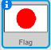
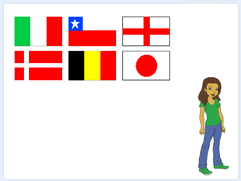
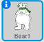

## Ask the question

Let's ask the player to name the flag for a particular country.

--- task ---
In the flag sprite, `broadcast the message`{:class="blockevents"} "announce country" immediately after the block which clones the flags.



```blocks
when flag clicked
create flag list
delete (all v) of [chosen flags v]
repeat (6)
    choose random flag
end
set [correct answer v] to (item (random v) of [chosen flags v])
clone flags
+ broadcast [announce country v]

```

[[[generic-scratch-broadcast-message]]]
--- /task ---

--- task ---
Add a new sprite of your choice to be your quiz master. We chose the bear for our example.



--- /task ---

--- task ---
Add some code to the character sprite so that, when it receives the broadcast "Announce country", the character will tell the player to click on the country name from the variable `correct answer`{:class="blockdata"}.



--- hints ---
--- hint ---
`When I receive`{:class="blockevents"} the broadcast, `say`{:class="blocklooks"} 'Click on the `correct answer`{:class="blockdata"}'.
--- /hint ---

--- hint ---
Here are the code blocks you'll need:

```blocks
(join [click on] [])

(correct answer)

say [] for (2) secs

when I receive [announce country v]
```

--- /hint ---

--- hint ---
This is what your code should look like:

```blocks
when I receive [announce country v]
say (join [click on] (correct answer)) for (2) secs
```
--- /hint ---

--- /hints ---
--- /task ---
