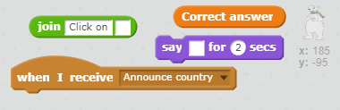
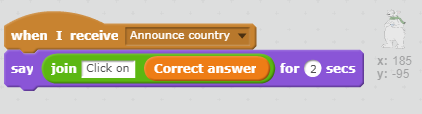

## Ask the question

+ In the **Flag sprite**, broadcast the message "Announce country" immediately after the block which clones the flags

[[[generic-scratch-broadcast-message]]]

+ Add a new sprite of your choice to be your question master. We chose the bear for our example.

[[[generic-scratch-sprite-from-library]]]

+ Inside the bear sprite, add some code to tell the player to click on the country name from the variable "Correct answer" when the sprite receives the broadcast "Announce country".

--- hints ---
--- hint ---
**When I receive** the broadcast
**Say** Click on **the correct answer**
--- /hint ---

--- hint ---
Here are the code blocks you'll need:

--- /hint ---

--- hint ---
This is what your code should look like:

--- /hint ---

--- /hints ---
