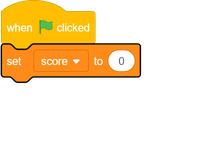
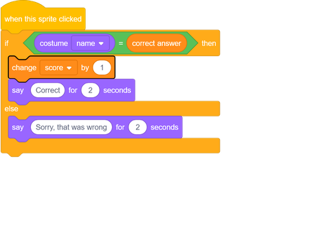

## Add a score

--- task ---
Create a new variable called `score`{:class="block3variables"} and set the score to `0`{:class="block3variables"} when the green flag is clicked.

--- /task ---

--- task ---
Add `1`{:class="block3variables"} to the score every time the player gives a correct answer.

--- /task ---
