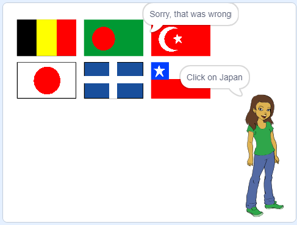

## Check the answer

We have asked the player to click on the flag they think is correct. Now we need to check whether they were correct or not.

+ Go back to the scripts for the Flag sprite

+ Add a block to start a new section of code which will happen **when this sprite is clicked**.

We need to check whether the costume of the sprite they clicked on has the same name as the correct answer.

+ Add code to say "Correct" if the costume name (text) of this sprite is the same as the "Correct answer" variable, or "Sorry, that was wrong" if it is not.

You can use this useful block here as well. This time, combine it with a **costume #** block to get the name of the current costume.

--- hints ---
--- hint ---
**When this sprite is clicked**
**Create the flags list**
**If** the **item in the flags list** with this **costume #** equals the **correct answer**
**Say** Correct
**Else**
**Say** Sorry, that was wrong
--- /hint ---

--- hint ---
Here are the code blocks you'll need:

--- /hint ---

--- hint ---
This is what your code should look like:

--- /hint ---

--- /hints ---

+ Press the green flag and test your code by getting the answer deliberately right and wrong. Check that the right message appears depending if you were right or wrong.

--- challenge ---
### Challenge
+ Play different sounds if the player was right and if the player was wrong

--- /challenge ---
