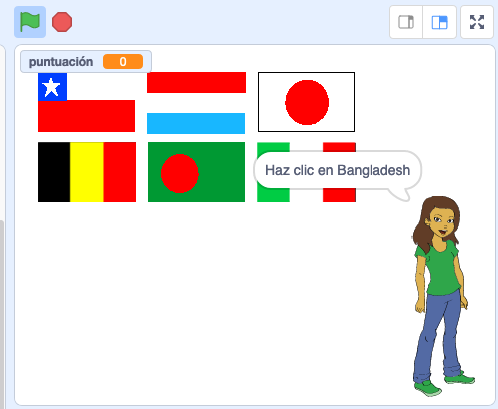

--- no-print ---

Esta es la versión **Scratch 3** del proyecto. También hay una [versión Scratch 2 del proyecto](https://projects.raspberrypi.org/es-LA/projects/guess-the-flag-scratch2).

--- /no-print ---

## Introducción

En este recurso, crearás un cuestionario de banderas para que te pongas a prueba y también a tus amigos. En el cuestionario, se muestran seis banderas y el nombre de un país, y debes hacer clic en la bandera correcta que coincida con el país.

### Lo que harás

--- no-print ---

Haz clic en la bandera del país que se te pregunta.

  <iframe allowtransparency="true" width="485" height="402" src="https://scratch.mit.edu/projects/embed/417343292/?autostart=false" frameborder="0" scrolling="no"></iframe>

--- /no-print ---

--- print-only ---

--- /print-only ---

--- collapse ---
---
title: Lo que vas a aprender
---

+ Cómo transmitir un mensaje y hacer que otros objetos respondan
+ Cómo seleccionar elementos aleatorios de una lista

--- /collapse ---

--- collapse ---
---
title: Lo que vas a necesitar
---

### Hardware

+ Un computador capaz de ejecutar Scratch 3

### Software

+ Scratch 3 (ya sea [con Internet](http://rpf.io/scratchon){:target="_blank"} o [sin conexión](http://rpf.io/scratchoff){:target="_blank"})

### Descargas

+ [Iniciar proyecto sin conexión](http://rpf.io/p/es-LA/guess-the-flag-go){:target="_blank"}

--- /collapse ---

--- collapse ---
---
title: Notas adicionales para educadores
---

--- no-print ---

Si necesitas imprimir este proyecto, usa la [versión para imprimir](https://projects.raspberrypi.org/es-LA/projects/guess-the-flag/print).

--- /no-print ---

Puedes [descargar aquí los recursos para este proyecto](http://rpf.io/p/es-LA/guess-the-flag-go){:target="_blank"}.

Puedes encontrar [aquí el proyecto completo](http://rpf.io/p/es-LA/guess-the-flag-get){:target="_blank"}.

--- /collapse ---