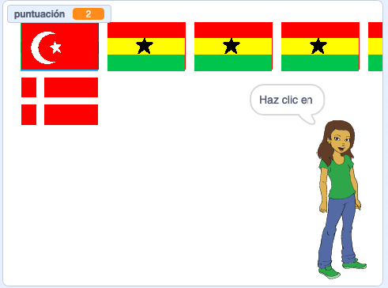

## Comienza una nueva ronda

Por el momento solo hay una ronda en el cuestionario, por lo que el cuestionario no dura mucho. Vas a configurar múltiples rondas.

--- task ---

Crea un `mensaje`{:class="block3control"} que diga «comenzar la ronda».


```blocks3
broadcast (comenzar la ronda v)
```

--- /task ---

--- task ---

Añade el bloque `al recibir «comenzar la ronda»`{:class="block3events"} y luego mueve todo el código debajo del bloque `al presionar la bandera verde`{:class="block3events"} y agregalo abajo de este nuevo bloque.


```blocks3
+ when I receive [comenzar la ronda v]
set [puntuación v] to [0]
crear lista de banderas :: custom
delete (all v) of [banderas elegidas v]
repeat (6)
    elegir bandera al azar :: custom
end
set [respuesta correcta v] to (item (pick random (1) to (length of [banderas elegidas v])) of [banderas elegidas v])
clonar banderas :: custom
+ broadcast (anunciar país v)
```

--- /task ---

--- task ---

Quita el bloque `fijar la puntuación a 0`{:class="block3variables"} y colócalo de nuevo abajo del bloque `al hacer clic en la bandera verde`{:class="block3control"}. Ahora añade el nuevo bloque `enviar`{:class="block3events"} debajo de ambos.


```blocks3
when green flag clicked
set [puntuación v] to [0]
broadcast (comenzar la ronda v)
```

--- /task ---

--- task ---

Después del código que comprueba si la respuesta está correcta, añade otro bloque `enviar`{:class="block3events"} para que comience una nueva ronda después de que se responda la pregunta.


```blocks3
when this sprite clicked
if <(costume [name v]) = (respuesta correcta :: variables)> then
    change [puntuación v] by [1]
    say [Correcto] for (2) seconds
else
    say [Lo sentimos, no es la respuesta correcta] for (2) seconds
end
+ broadcast (comenzar la ronda v)
```

--- /task ---

--- task ---

Haz clic en la bandera verde para probar tu código. Haz clic en una de las banderas para jugar la ronda. ¿Te das cuenta que la siguiente ronda no se configura de manera correcta?



--- /task ---

Esto se debe a que antes que el juego comience otra ronda, el juego primero tiene que limpiar las banderas clonadas.

--- task ---

Crea otro `enviar`{:class="block3events"} que se llame «limpiar».


```blocks3
broadcast (limpiar v)
```

--- /task ---

--- task ---

Establece la bandera en `eliminar este clon`{:class="block3control"} cuando reciba el mensaje `limpiar`{:class="block3events"}.


```blocks3
whenI receive [limpiar v]
delete this clone
```

--- /task ---

--- task ---

Coloca el bloque enviar `limpiar`{:class="block3events"} justo sobre el bloque comenzar una nueva ronda, después de obtener respuesta.

```blocks3
when this sprite clicked
crear lista de banderas  :: custom
if <(item (costume [number v]) of [banderas v]) = (respuesta correcta :: variables)> then
    say [Correcto] for (2) seconds
    change [puntuación v] by [1]
else
    say [Lo sentimos, no es la respuesta correcta] for (2) seconds
end
+ broadcast (limpiar v)
broadcast (comenzar la ronda v)
```

--- /task ---

--- task ---

Prueba tu código de nuevo y comprueba si funciona el juego en varias rondas, y que la puntuación aumenta a medida que obtienes respuestas correctas.

--- /task ---

--- task ---

¡Asegúrate de ocultar la variable `respuesta correcta`{:class="block3variables"} para que el jugador no pueda verla!

--- /task ---