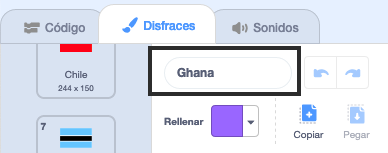
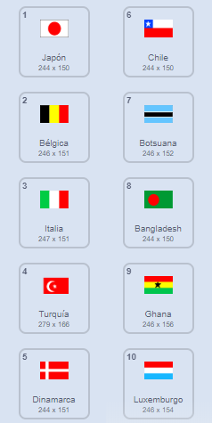

## Dibuja las banderas

\--- task \---

Abre el proyecto inicial de Scratch: «Adivina la bandera».

**Con Internet**: abra un nuevo proyecto Scratch en línea en [ rpf.io/guess-the-flag-on ](http://rpf.io/guess-the-flag-on)"}. Si tienes una cuenta de Scratch, puedes hacer clic en **Remix** en la esquina superior derecha del editor en línea para guardar una copia del proyecto.

**Sin conexión**: abre el [proyecto de inicio](http://rpf.io/p/en/guess-the-flag-go) en el editor sin conexión.

Si necesitas descargar e instalar el editor sin conexión de Scratch, puedes encontrarlo en [rpf.io/scratchoff](http://rpf.io/scratchoff){:target="_blank"}.

\--- /task \---

Selecciona la pestaña de Disfraces. Ahí deberías ver ocho banderas.

Desplázate hasta el final de la lista de disfraces, donde hay dos disfraces en blanco. Estos disfraces están ahí para que puedas añadir tus propias banderas.

\--- task \---

Haz clic en el disfraz «Tu bandera 1» y cambia su nombre por el nombre de un país.

\--- /task \---

\--- task \---

Dibuja la bandera de ese país. Asegúrate de que tu dibujo tiene exactamente el mismo tamaño que el disfraz de bandera.

Si se te acabaron las ideas, puedes encontrar algunas banderas en [esta página web «Banderas del mundo»](https://www.countries-ofthe-world.com/flags-of-the-world.html){:target="_blank"}.

\--- /task \---

\--- task \---

Repite este proceso para el segundo disfraz de bandera en blanco de modo que hayan en total diez disfraces de banderas.

\--- /task \---

Aquí están las banderas de ejemplo en el proyecto «Adivina la bandera», pero puedes elegir las banderas que quieras para tu juego. 

