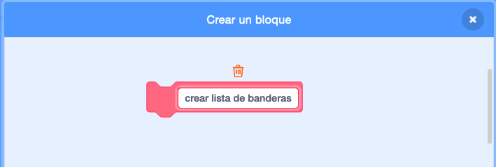

## Crea la lista de banderas

--- task ---

Haz clic en la pestaña de Código. Hay una lista llamada `banderas`{:class="block3variables"}, en donde guardas los nombres de los países y que además tu juego tiene disfraces para cada uno de ellos.

--- /task ---

--- task ---

Añade dos bloques más de código, uno por cada una de las banderas que creaste, así que hay un total de diez bloques que suman un total de diez países en la lista `banderas`{:class="block3variables"}.


```blocks3
add [País] to [banderas v]
```

--- /task ---

--- task ---

Haz clic en la bandera verde y comprueba que los países aparezcan en la lista.

--- /task ---

Si presionas la bandera verde más de una vez, los países se vuelven a añadir a la lista y el resultado será una lista de 20 países en lugar de 10.

--- task ---

Al inicio del código, añade un bloque para `eliminar todos`{:class="block3variables"} los países de la lista antes de añadirlos. Esto impedirá que los países se añadan a la lista más de una vez.


```blocks3
when green flag clicked
+ delete (all v) of [banderas v]
add [Japón] to [banderas v]
add [Bélgica] to [banderas v]
add [Italia] to [banderas v]
add [Turquía] to [banderas v]
add [Dinamarca] to [banderas v]
add [Chile] to [banderas v]
add [Botsuana] to [banderas v]
add [Bangladesh] to [banderas v]
add [Ghana] to [banderas v]
add [Luxemburgo] to [banderas v]
```

--- /task ---

A continuación, crea un bloque personalizado. Un bloque personalizado es un bloque especial con un nombre. El bloque personalizado que crearás te permitirá crear una lista de banderas para usar solo este bloque en lugar de un montón de bloques.

--- task ---

Haz clic en **Mis bloques** y luego haz clic en **Crear un bloque**. Dale el nombre de `crear lista de banderas`{:class="block3myblocks"} a tu bloque personalizado.




--- /task ---

--- task ---

Aparta todo el código que está abajo del bloque `al presionar la bandera`{:class="block3events"} abajo del nuevo bloque `crear lista de banderas`{:class="block3myblocks"}.

```blocks3
define crear lista de banderas
delete (all v) of [banderas v]
add [Japón] to [banderas v]
add [Bélgica] to [banderas v]
add [Italia] to [banderas v]
add [Turquía] to [banderas v]
add [Dinamarca] to [banderas v]
add [Chile] to [banderas v]
add [Botsuana] to [banderas v]
add [Bangladesh] to [banderas v]
add [Ghana] to [banderas v]
add [Luxemburgo] to [banderas v]
```

--- /task ---

--- task ---

Abajo del bloque `al presionar la bandera`{:class="block3events"}, añade el nuevo bloque `crear lista de banderas`{:class="block3myblocks"}.


```blocks3
when green flag clicked
crear lista de banderas :: custom
```

--- /task ---