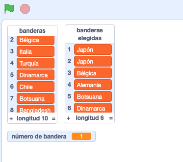

## Elige banderas al azar

Para cada ronda del cuestionario, elige al azar seis banderas de la lista `banderas`{:class="block3variables"} para que sean las opciones.

\--- task \---

Crea una nueva lista llamada `banderas elegidas`{:class="block3variables"}. Esta lista almacenará las seis banderas elegidas al azar.

\--- /task \---

\--- task \---

Crea una variable llamada `número de bandera`{:class="block3variables"}.

\--- /task \---

\--- task \---

Crea un bloque personalizado y llámalo `elige una bandera al azar`{:class="block3myblocks"}.


```blocks3
definir elegir bandera al azar
```

\--- /task \---

\--- task \---

Añade código al bloque personalizado para establecer a la variable `número de bandera`{:class="block3variables"} números al azar entre el `1` y la cantidad de elementos de la lista `banderas`{:class="block3variables"}.


Hay un bloque especial en la pestaña Variables para encontrar el número de elementos en una lista.

\--- hints \--- \--- hint \---

Establece la variable `número de bandera`{:class="block3variables"} a un `número al azar`{:class="block3operators"} entre `1` y la `longitud de la lista de «banderas»`{:class="block3variables"}.

\--- /hint \---

\--- hint \---

Aquí están los bloques de código que necesitas:

```blocks3
(longitud de [banderas v])

(elegir número al azar entre (1) y (10))

definir elegir bandera al azar

establecer [número de bandera v] en []
```

\--- /hint \---

\--- hint \---

Así quedaría tu código:

```blocks3
definir elegir bandera al azar
establecer [número de v] a (elegir número al azar (1) a (longitud de [banderas v]))
```

\--- /hint \---

\--- /hints \--- \--- /task \---

Ese bloque elige a un elemento de la lista a través de un número:

```blocks3
(elemento (10 v) de [banderas v])
```

\--- task \---

Combine this block with the `flag number`{:class="block3variables"} variable to get the text of the randomly chosen item from the `flags`{:class="block3variables"} list. Then add the item text into the `chosen flags`{:class="block3variables"} list. Add this code to your custom block:


```blocks3
define choose random flag
set [flag number v] to (pick random (1) to (length of [flags v]))
+ add (item (flag number) of [flags v]) to [chosen flags v]
```

\--- /task \---

\--- task \---

Add the custom `choose random flag`{:class="block3myblocks"} block to the code that runs after the green flag is clicked.


```blocks3
when green flag clicked
create flag list :: custom
+ choose random flag :: custom
```

\--- /task \---

\--- task \---

Test that your code works by clicking the green flag several times and checking that different countries are added to the `chosen flags`{:class="block3variables"} list every time. (If you have hidden the list, tick the box next to the list name to make the list visible.)

\--- /task \---

Can you see that, if you click the green flag lots of times, your `chosen flags`{:class="block3variables"} list quickly fills up with more than six items?

\--- task \---

Add blocks to delete all the items from the `chosen flags`{:class="block3variables"} list before choosing six flags for the quiz.


```blocks3
when green flag clicked
create flag list :: custom
+ delete (all v) of [chosen flags v]
+ repeat (6)
    choose random flag :: custom
end
```

\--- /task \---

\--- task \---

Test your code again by clicking the green flag several times and checking that the `chosen flags` list is filled with six countries each time.

\--- /task \---

You might notice that sometimes the same country gets added to the list more than once.



\--- task \---

Change your `choose random flag`{:class="block3myblocks"} block so that the same country never gets added twice to the `chosen flags`{:class="block3variables"} list.

Add a block to the end of your custom block code to delete the `flag number`{:class="block3variables"} from the `flags`{:class="block3variables"} list after it has been added to the `chosen flags`{:class="block3variables"} list.


```blocks3
define choose random flag
set [flag number v] to (pick random (1) to (length of [flags v]))
add (item (flag number) of [flags v]) to [chosen flags v]
+ delete (flag number) of [flags v]
```

\--- /task \---

If you want to hide the lists and variables so that they don't take up space on the Stage, go to the Data section and unselect the boxes next to the list names or variable names. If you want to show the lists and variables again, just select the boxes.