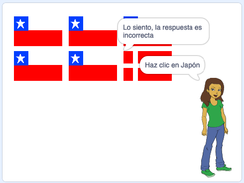

## Comprueba la respuesta

Ahora tu objeto le pide al jugador que haga clic en la bandera correcta. Ahora, el juego debe verificar si la bandera que se presionó es la respuesta correcta.

\--- task \---

Vuelve al código del objeto bandera y agrega el bloque para comenzar la nueva sección de código que se ejecutará `al presionar este objeto `{:class="block3events"}.


\--- /task \---

Ahora, tu cuestionario de banderas debe verificar si el nombre del disfraz del objeto bandera que se presionó es el mismo que la respuesta correcta.

\--- task \---

Añade código para que diga «Correcto» si es que el nombre del disfraz del objeto Bandera es el mismo que la variable `respuesta correcta`{:class="block3variables"}, o que diga «Lo siento, la respuesta es incorrecta» si el nombre y la variable no son iguales.

Acá también usarás este bloque útil.

```blocks3
(elemento (10 v) de [banderas v])
```

Pero ahora combínalo con el bloque `nombre del disfraz`{:class="block3looks"} para obtener el nombre del actual disfraz del objeto Bandera.


\--- hints \--- \--- hint \---

`Al presionar este objeto`{:class="block3events"}, `si`{:class="block3control"} este `nombre del disfraz`{:class="block3looks"} equivale a la `respuesta correcta`{:class="block3variables"}, `decir`{:class="block3looks"} «Correcto»,`sino`{:class="block3control"} `decir`{:class="block3looks"} «Lo siento».

\--- /hint \---

\--- hint \---

Aquí están los bloques de código que necesitas:

```blocks3
decir [Lo siento, respuesta equivocada] por (2) segundos

decir [Correct] por (2) segundos

si <> 
sino
fin

(disfraz [nombre v])

<[] = []>

(respuesta correcta)

al presiona este objeto
```

\--- /hint \---

\--- hint \---

Así es como se debería ver tu código:

```blocks3
al presionar este objeto
si <(disfraz [nombre v]) = (respuesta correcta :: variables)> then
    decir [Correct] por (2) segundos
sino
    decir [Lo siento, respuesta equivocada] por (2) segundos
fin
```

\--- /hint \---

\--- /hints \--- \--- /task \---

\--- task \---

Presiona la bandera verde y prueba tu código dos veces: al elegir la bandera correcta y la incorrecta. Comprueba que aparece el mensaje correcto en el caso de que escojas la respuesta correcta o incorrecta.



\--- /task \---