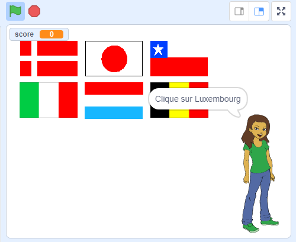

--- no-print ---

Ceci est la version **Scratch 3** du projet. Il existe également une version [Scratch 2 du projet](https://projects.raspberrypi.org/fr-FR/projects/guess-the-flag-scratch2).

--- /no-print ---

## Introduction

Dans cette ressource, tu vas créer un quiz de drapeau pour te tester et tester tes amis. Dans le quiz, six drapeaux et le nom d'un pays sont affichés, tu dois cliquer sur le bon drapeau qui correspond au pays.

### Ce que tu feras

--- no-print ---

Clique sur le drapeau du pays qui t'est demandé.

  <iframe allowtransparency="true" width="485" height="402" src="https://scratch.mit.edu/projects/embed/550830603/?autostart=false" frameborder="0" scrolling="no"></iframe>

--- /no-print ---

--- print-only ---

--- /print-only ---

--- collapse ---
---
title: Ce que tu vas apprendre
---

+ Comment diffuser un message et demander à d'autres sprites de répondre
+ Comment sélectionner des éléments aléatoires dans une liste

--- /collapse ---

--- collapse ---
---
title: Ce qu'il te faut
---

### Matériel informatique

+ Un ordinateur capable d'exécuter Scratch 3

### Logiciel

+ Scratch 3 (soit [en ligne](http://rpf.io/scratchon){:target="_blank"} ou [hors ligne](http://rpf.io/scratchoff){:target="_blank"})

### Téléchargements

+ [Projet de démarrage hors ligne](http://rpf.io/p/fr-FR/guess-the-flag-go){:target="_blank"}

--- /collapse ---

--- collapse ---
---
title: Informations supplémentaires pour les éducateurs
---

--- no-print ---

Si vous avez besoin d'imprimer ce projet, merci d'utiliser la [version imprimable](https://projects.raspberrypi.org/fr-FR/projects/guess-the-flag/print).

--- /no-print ---

Vous pouvez [télécharger les ressources de ce projet ici](http://rpf.io/p/fr-FR/guess-the-flag-go){:target="_blank"}.

Vous pouvez trouver le [projet terminé ici](http://rpf.io/p/fr-FR/guess-the-flag-get){:target="_blank"}.

--- /collapse ---