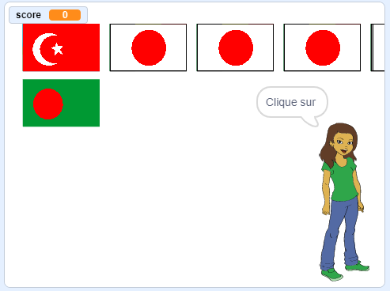

## Commencer une nouvelle partie

Pour le moment, il n'y a qu'une seule partie dans le quiz, donc le quiz ne dure pas longtemps. Tu vas mettre en place plusieurs parties.

\--- task \---

Crée un nouveau `envoyer à tous`{:class="block3events"} qui envoie le message « Commencer la partie ».


```blocks3
broadcast (start the round v)
```

\--- /task \---

\--- task \---

Ajoute un bloc `quand je reçois le bloc « Commencer la partie »'`{:class="block3events"}, puis déplace tout le code qui se trouve sous le bloc `quand le drapeau vert est cliqué`{:class="block3events"} en dessous de ce nouveau bloc.


```blocks3
+ when I receive [start the round v]
set [score v] to [0]
create flag list :: custom
delete (all v) of [chosen flags v]
repeat (6)
    choose random flag :: custom
end
set [correct answer v] to (item (pick random (1) to (length of [chosen flags v])) of [chosen flags v])
clone flags :: custom
+ broadcast (announce country v)
```

\--- /task \---

\--- task \---

Supprime le bloc `mettre le score à 0`{:class="block3variables"} et place-le en dessous du bloc `quand le drapeau vert est cliqué`{:class="block3control"}. Ajoute ensuite le nouveau bloc `envoyer à tous`{:class="block3events"} sous chacun d'eux.


```blocks3
when green flag clicked
set [score v] to [0]
broadcast (start the round v)
```

\--- /task \---

\--- task \---

Après le code vérifiant si la réponse est correcte, ajoute un autre bloc `envoyer à tous`{:class="block3events"} pour qu'une nouvelle partie puisse commencer après qu'une question soit répondue.


```blocks3
when this sprite clicked
if <(costume [name v]) = (correct answer :: variables)> then
    change [score v] by [1]
    say [Correct] for (2) seconds
else
    say [Sorry, that was wrong] for (2) seconds
end
+ broadcast (start the round v)
```

\--- /task \---

\--- task \---

Clique sur le drapeau vert pour tester ton code. Clique sur l'un des drapeaux pour jouer une partie. As-tu remarqué que la partie suivante ne se met pas en place correctement ?



\--- /task \---

C'est parce qu'avant de commencer une nouvelle partie, le jeu doit d'abord effacer les drapeaux clonés.

\--- task \---

Crée un nouveau `envoyer à tous`{:class="block3events"} appelé « effacer ».


```blocks3
broadcast (clean up v)
```

\--- /task \---

\--- task \---

Définit le sprite Drapeau sur `supprimer ce clone`{:class="block3control"} quand il reçoit le message `effacer`{:class="block3events"}.


```blocks3
when I receive [clean up v]
delete this clone
```

\--- /task \---

\--- task \---

Place le bloc de diffusion `effacer`{:class="block3events"} juste au-dessus de l'endroit où le jeu commence une nouvelle partie après qu'une réponse ait été donnée.

```blocks3
when this sprite clicked
create flags list  :: custom
if <(item (costume [number v]) of [flags v]) = (correct answer :: variables)> then
    say [Correct] for (2) seconds
    change [score v] by [1]
else
    say [Sorry, that was wrong] for (2) seconds
end
+ broadcast (clean up v)
broadcast (start the round v)
```

\--- /task \---

\--- task \---

Teste à nouveau ton code et vérifie que tu peux jouer plusieurs parties, et que ton score augmente lorsque la réponse est correcte.

\--- /task \---

\--- task \---

Assure-toi de cacher la variable `réponse correcte`{:class="block3variables"} pour que le joueur ne puisse pas la voir !

\--- /task \---