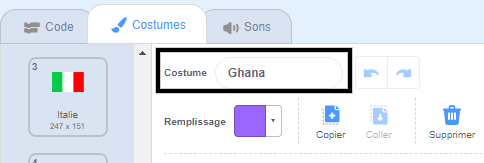
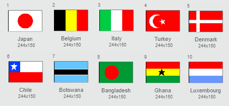

## Dessiner les drapeaux

--- task ---

Ouvre le projet de démarrage Scratch « Devine le drapeau ».

**En ligne :** ouvre le projet de démarrage sur [scratch.mit.edu/projects/550830827](https://scratch.mit.edu/projects/550830827){:target="_blank"}. Si tu as un compte Scratch, tu peux cliquer sur **Remix** dans le coin supérieur droit de l'éditeur en ligne pour enregistrer une copie du projet.

**Hors ligne :** ouvre le [projet de démarrage](http://rpf.io/p/fr-FR/guess-the-flag-go) dans l'éditeur hors ligne.

Si tu dois télécharger et installer l'éditeur hors ligne Scratch, tu peux le trouver sur [rpf.io/scratchoff](http://rpf.io/scratchoff){:target="_blank"}.

--- /task ---

Sélectionne l'onglet Costumes. Tu devrais y voir huit drapeaux.

Fais défiler vers le bas de la liste des costumes, où il y a deux costumes vides. Ces costumes sont là pour que tu puisses ajouter tes propres drapeaux.

--- task ---

Clique sur le costume « Ton drapeau 1 » et change son nom pour le nom d'un pays.

--- /task ---

--- task ---

Dessine le drapeau de ce pays. Assure-toi que ton dessin est exactement de la même taille que le costume du drapeau.

Si tu as du mal à trouver des idées, tu peux trouver quelques drapeaux sur [cette page web « Drapeaux du monde »](https://www.countries-ofthe-world.com/flags-of-the-world.html){:target="_blank"}.

--- /task ---

--- task ---

Répète ce processus pour le deuxième costume de drapeau vide pour qu'il y ait dix costumes de drapeau au total.

--- /task ---

Voici les drapeaux qui servent d'exemples dans le projet « Devine le drapeau », mais tu peux choisir tous les drapeaux que tu aimes pour ton jeu.

