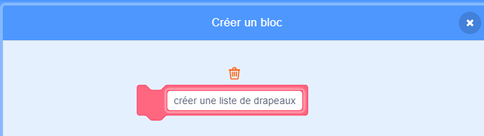

## Créer une liste de drapeaux

--- task ---

Clique sur l'onglet Code. Il y a une liste appelée `drapeaux`{:class="block3variables"}, où tu peux entrer les noms de pays pour lesquels ton jeu a des costumes de drapeau.

--- /task ---

--- task ---

Ajoute deux autres blocs de code, un pour chacun des deux autres drapeaux que tu as créé, de sorte qu'il y ait un total de dix blocs qui ajoutent les dix pays à la liste des `drapeaux`{:class="block3variables"}.


```blocks3
add [Pays] to [drapeaux v]
```

--- /task ---

--- task ---

Clique sur le drapeau vert et vérifie que les pays apparaissent dans la liste.

--- /task ---

Si tu appuies plusieurs fois sur le drapeau vert, les pays sont à nouveau ajoutés à la liste, et le résultat est une liste de 20 pays au lieu de 10.

--- task ---

Au début du code, ajoute un bloc pour `supprimer tous`{:class="block3variables"} les pays de la liste avant de les ajouter. Cela empêchera les pays d'être ajoutés à la liste plus d'une fois.


```blocks3
when green flag clicked
+ delete (all v) of [drapeaux v]
add [Japon] to [drapeaux v]
add [Belgique] to [drapeaux v]
add [Italie] to [drapeaux v]
add [Turquie] to [drapeaux v]
add [Danemark] to [drapeaux v]
add [Danemark] to [drapeaux v]
add [Botswana] to [drapeaux v]
add [Bangladesh] to [drapeaux v]
add [Ghana] to [drapeaux v]
add [Luxembourg] to [drapeaux v]
```

--- /task ---

Ensuite, crée un bloc personnalisé. Un bloc personnalisé est un bloc spécial avec un nom. Le bloc personnalisé que tu vas faire te permettra de créer une liste de drapeaux en utilisant seulement ce bloc plutôt que d'en utiliser plusieurs.

--- task ---

Clique sur **Mes Blocs** puis sur **Créer un Bloc**. Nomme ton bloc personnalisé `créer une liste de drapeaux`{:class="block3myblocks"}.




--- /task ---

--- task ---

Déplace tout le code qui se trouve sous le bloc `quand le drapeau vert est cliqué` vers le bloc `créer une liste de drapeaux`{:class="block3myblocks"}.

```blocks3
define create flag list
delete (all v) of [drapeaux v]
add [Japon] to [drapeaux v]
add [Belgique] to [drapeaux v]
add [Italie] to [drapeaux v]
add [Turquie] to [drapeaux v]
add [Danemark] to [drapeaux v]
add [Danemark] to [drapeaux v]
add [Botswana] to [drapeaux v]
add [Bangladesh] to [drapeaux v]
add [Ghana] to [drapeaux v]
add [Luxembourg] to [drapeaux v]
```

--- /task ---

--- task ---

En dessous du bloc `quand le drapeau vert est cliqué`{:class="block3events"}, ajoute le nouveau bloc `créer une liste de drapeaux`{:class="block3myblocks"}.


```blocks3
when green flag clicked
créer une liste de drapeaux :: custom
```

--- /task ---