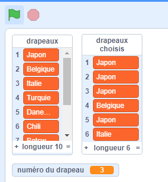

## Choisir des drapeaux aléatoires

Pour chaque partie du quiz, choisis six drapeaux au hasard dans la liste des `drapeaux`{:class="block3variables"} pour constituer les options.

\--- task \---

Crée une autre liste appelée `drapeaux choisis`{:class="block3variables"}. Cette liste stockera les six drapeaux aléatoires.

\--- /task \---

\--- task \---

Crée une variable appelée `numéro du drapeau`{:class="block3variables"}.

\--- /task \---

\--- task \---

Crée un bloc personnalisé et appelle-le `choisir un drapeau aléatoire`{:class="block3myblocks"}.


```blocks3
define choose random flag
```

\--- /task \---

\--- task \---

Ajoute du code au bloc personnalisé pour définir la variable `numéro du drapeau`{:class="block3variables"} à un nombre aléatoire entre `1` et le nombre d'éléments dans la liste `drapeaux`{:class="block3variables"}.


Il y a un bloc spécial dans l'onglet Variables pour trouver le nombre d'éléments dans une liste.

\--- hints \--- \--- hint \---

Définis la variable `numéro du drapeau`{:class="block3variables"} à un `nombre aléatoire`{:class="block3operators"} entre `1` et la `longueur de la liste « drapeaux »`{:class="block3variables"}.

\--- /hint \---

\--- hint \---

Voici les blocs dont tu as besoin :

```blocks3
(length of [flags v])

(pick random (1) to (10))

define choose random flag

set [flag number v] to []
```

\--- /hint \---

\--- hint \---

Voici à quoi ton code devrait ressembler :

```blocks3
define choose random flag
set [flag number v] to (pick random (1) to (length of [flags v]))
```

\--- /hint \---

\--- /hints \--- \--- /task \---

Ce bloc sélectionne un élément d'une liste par numéro :

```blocks3
(item (10 v) of [flags v])
```

\--- task \---

Combine ce bloc avec la variable `numéro du drapeau`{:class="block3variables"} pour obtenir le texte de l'élément choisi au hasard à partir de la liste `drapeaux`{:class="block3variables"}. Ajoute ensuite le texte de l'élément dans la liste `drapeaux choisis`{:class="block3variables"}. Ajoute ce code à ton bloc personnalisé :


```blocks3
define choose random flag
set [flag number v] to (pick random (1) to (length of [flags v]))
+ add (item (flag number) of [flags v]) to [chosen flags v]
```

\--- /task \---

\--- task \---

Ajoute le bloc personnalisé `choisir un drapeau aléatoire`{:class="block3myblocks"} au code qui s'exécute après que le drapeau vert soit cliqué.


```blocks3
when green flag clicked
create flag list :: custom
+ choose random flag :: custom
```

\--- /task \---

\--- task \---

Teste que ton code fonctionne en cliquant plusieurs fois sur le drapeau vert et en vérifiant que différents pays sont ajoutés à la liste des `drapeaux choisis`{:class="block3variables"} à chaque fois. (Si tu as masqué la liste, coche la case à côté du nom de la liste pour rendre la liste visible.)

\--- /task \---

Est-ce que tu remarques que, lorsque tu cliques sur le drapeau vert plusieurs fois, la liste `drapeaux choisis`{:class="block3variables"} se remplit rapidement avec plus de six éléments?

\--- task \---

Ajoute des blocs pour supprimer tous les éléments de la liste `drapeaux choisis`{:class="block3variables"} avant de choisir six drapeaux pour le quiz.


```blocks3
when green flag clicked
create flag list :: custom
+ delete (all v) of [chosen flags v]
+ repeat (6)
    choose random flag :: custom
end
```

\--- /task \---

\--- task \---

Teste ton code à nouveau en cliquant plusieurs fois sur le drapeau vert et en vérifiant que la liste `drapeaux choisis` est remplie avec six pays à chaque fois.

\--- /task \---

Tu remarqueras que, parfois, le même pays est ajouté à la liste plus d'une fois.



\--- task \---

Change ton bloc `choisir un drapeau aléatoire`{:class="block3myblocks"} pour que le même pays ne soit jamais ajouté deux fois à la liste `drapeaux choisis`{:class="block3variables"}.

Ajoute un bloc à la fin de ton bloc personnalisé pour supprimer `numéro du drapeau`{:class="block3variables"} de la liste `drapeaux`{:class="block3variables"} après qu'il ait été ajouté à la liste `drapeaux choisis`{:class="block3variables"}.


```blocks3
define choose random flag
set [flag number v] to (pick random (1) to (length of [flags v]))
add (item (flag number) of [flags v]) to [chosen flags v]
+ delete (flag number) of [flags v]
```

\--- /task \---

Si tu veux masquer les listes et les variables pour qu'elles ne prennent pas de place sur la scène, va dans la section Données et désélectionne les cases à côté des noms de liste ou des noms de variables. Si tu veux afficher à nouveau les listes et les variables, il te suffit de sélectionner les cases.