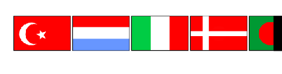

## Afficher les drapeaux

La personne qui répond au quiz a besoin de voir les photos des drapeaux dans la liste des `drapeaux choisis`{:class="block3variables"}.

\--- task \---

Crée un autre bloc personnalisé, et appelle-le `cloner les drapeaux`{:class="block3myblocks"}.


```blocks3
define clone flags
```

\--- /task \---

Ce bloc personnalisé clonera le sprite Drapeau six fois, une fois pour chaque drapeau qui doit être affiché.

Le premier drapeau doit être affiché dans le coin supérieur gauche de la scène.

\--- task \---

Dans ton bloc `cloner les drapeaux`{:class="block3myblocks"}, ajoute l'instruction pour rendre le sprite drapeau visible, puis ajoute un bloc `aller à`{:class="block3motion"} pour dire au sprite d'aller aux coordonnées `-170`{:class="block3motion"}, `120`{:class="block3motion"} dans le coin supérieur gauche de la scène.


```blocks3
define clone flags
show
go to x: (-170) y: (120)
```

\--- /task \---

\--- task \---

Au-dessous de ce code, ajoute une boucle qui se répète six fois.


À l'intérieur de la boucle, ajoute des blocs de code pour basculer le costume du sprite vers le premier drapeau dans la liste des `drapeaux choisis`{:class="block3variables"} et pour cloner le sprite. Ensuite, ajoute des blocs de code pour supprimer le premier drapeau de la liste, et pour ajouter la coordonnée `110`{:class="block3motion"} à la position `x`{:class="block3motion"} pour déplacer le sprite à la position du second drapeau.

\--- hints \--- \--- hint \---

`Répéter`{:class="block3control"} six fois : `Basculer sur le costume`{:class="block3looks"} pour le `premier élément dans les drapeaux choisis`{:class="block3variables"}. `Cloner le sprite`{:class="block3control"}. `Supprimer`{:class="block3variables"} le `premier élément dans les drapeaux choisis`{:class="block3variables"}. `Déplacer vers la droite de 110`{:class="block3motion"}.

\--- /hint \---

\--- hint \---

Voici les blocs de code que tu dois ajouter :

```blocks3
(item (1) of [chosen flags v])

change x by (110)

create clone of (myself v)

switch costume to ( v)

delete (1) of [chosen flags v]

repeat (6)
end
```

\--- /hint \---

\--- hint \---

Voici à quoi ton code devrait ressembler :

```blocks3
define clone flags
show
go to x: (-170) y: (120)
+ repeat (6)
    switch costume to (item (1) of [chosen flags v])
    create clone of (myself v)
    delete (1) of [chosen flags v]
    change x by (110)
end
```

\--- /hint \---

\--- /hints \--- \--- /task \---

\--- task \---

Ajoute ton bloc `cloner les drapeaux`{:class="block3myblocks"} à la fin du code qui s'exécute quand le drapeau vert est cliqué.


```blocks3
when green flag clicked
create flag list :: custom
delete (all v) of [chose flags v]
repeat (6)
  choose random flag :: custom
end
+ clone flags :: custom
```

\--- /task \---

\--- task \---

Exécute ton code. Note que les différents drapeaux apparaissent, mais certains sont coupés par le bord de la scène.



\--- /task \---

Au lieu de mettre les six drapeaux en une ligne, crée deux rangées de trois drapeaux.

\--- task \---

Ajoute du code dans la boucle `répéter`{:class="block3control"} du bloc `cloner les drapeaux`{:class="block3myblocks"} pour déplacer le sprite Drapeau vers le bas d'une ligne s'il reste trois drapeaux dans la liste `drapeaux choisis`{:class="block3variables"}.


Tu peux faire descendre le sprite d'une ligne en utilisant un autre bloc `aller à`{:class="block3motion"} et en gardant la coordonnée `x`{:class="block3motion"} identique au point de départ, mais en diminuant la coordonnée `y`{:class="block3motion"} pour descendre.

```blocks3
define clone flags
show
go to x: (-170) y: (120)
repeat (6)
    switch costume to (item (1) of [chosen flags v])
    create clone of (myself v)
    delete (1) of [chosen flags v]
    change x by (110)
+   if <(length of [chosen flags v]) = [3]> then
        go to x: (-170) y: (50)
    end
end
```

\--- /task \---

\--- task \---

Clique sur le drapeau vert et vérifie que les drapeaux s'affichent sur deux lignes.

\--- /task \---

On dirait que le dernier drapeau est affiché deux fois. Ceci est dû au fait que le sprite Drapeau original est toujours visible à la fin.

\--- task \---

Ajoute un bloc `cacher`{:class="block3looks"} à la fin du code à l'intérieur du bloc `cloner les drapeaux`{:class="block3myblocks"} pour masquer le sprite original.


\--- /task \---

Si tu le souhaites, tu peux essayer de faire apparaître les sprites des drapeaux un par un ou de jouer un son (un pop, par exemple) chaque fois qu'un drapeau apparaît.