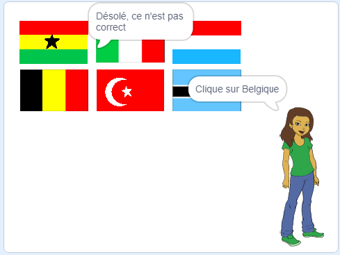

## Vérifier la réponse

Ton sprite demande maintenant au joueur de cliquer sur le bon drapeau. Ensuite, le jeu doit vérifier si le drapeau qui a été cliqué est la bonne réponse.

--- task ---

Reviens au code du sprite Drapeau et ajoute un bloc pour démarrer une nouvelle section de code qui s'exécutera `quand ce sprite est cliqué`{:class="block3events"}.


--- /task ---

Ensuite, ton quiz doit vérifier si le nom du costume du sprite Drapeau qui a été cliqué est le même que la bonne réponse.

--- task ---

Ajoute du code pour dire « Correct » si le nom du costume du sprite Drapeau est le même que la variable `réponse correcte`{:class="block3variables"}, ou pour dire « Désolé, ce n'est pas correct » si le nom et la variable ne sont pas les mêmes.

Tu peux utiliser ce bloc utile ici aussi.

```blocks3
(item (10 v) of [drapeaux v])
```

Cette fois, combine-le avec un bloc `nom du costume`{:class="block3looks"} pour obtenir le nom du costume du sprite Drapeau actuel.


--- hints ---
 --- hint ---

`Quand ce sprite est cliqué`{:class="block3events"}, `si`{:class="block3control"} ce `nom du costume`{:class="block3looks"} est égal à la `réponse correcte`{:class="block3variables"}, `dire`{:class="block3looks"} « Correct », ou `sinon`{:class="block3control"} `dire`{:class="block3looks"} « Désolé, ce n'est pas correct ».

--- /hint ---

--- hint ---

Voici les blocs de code dont tu as besoin :

```blocks3
say [Désolé, ce n'est pas correct] for (2) seconds

say [Correct] for (2) seconds

if <> then
else
end

(costume [name v])

<[] = []>

(réponse correcte)

when this sprite clicked
```

--- /hint ---

--- hint ---

Voici à quoi ton code devrait ressembler :

```blocks3
when this sprite clicked
if <(costume [name v]) = (réponse correcte :: variables)> then
    say [Correct] for (2) seconds
else
    say [Désolé, ce n'est pas correct] for (2) seconds
end
```

--- /hint ---

--- /hints --- --- /task ---

--- task ---

Appuie sur le drapeau vert et teste ton code deux fois : une fois en choisissant le bon drapeau, et une fois en choisissant un drapeau incorrect. Vérifie que le bon message apparaît selon que tu donnes la bonne ou la mauvaise réponse.



--- /task ---