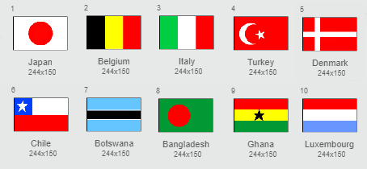

## झंडे बनाएँ

--- task ---

'गेस द फ्लैग ’ स्क्रैच स्टार्टर प्रोजेक्ट खोलें।

**ऑनलाइन:** [rpf.io/guess-the-flag-on](http://rpf.io/guess-the-flag-on){:target="_blank"} पर स्टार्टर प्रोजेक्ट खोलें। यदि आपके पास Scratch खाता है, तो आप प्रोजेक्ट की प्रति सहेजने के लिए ऑनलाइन एडिटर के ऊपरी दाएँ कोने पर **Remix** को क्लिक कर सकते हैं।

**ऑफ़लाइन:** ऑफ़लाइन संपादक में [स्टार्टर प्रोजेक्ट](http://rpf.io/p/hi-IN/guess-the-flag-go) खोलें।

यदि आपको स्क्रैच ऑफ़लाइन संपादक को डाउनलोड और इंस्टॉल करने की आवश्यकता है, तो आप इसे [rpf.io/scratchoff](http://rpf.io/scratchoff){:target="_blank"} पर पा सकते हैं।

--- /task ---

परिधान टैब का चयन करें। वहाँ आपको आठ झंडे दिखाई देने चाहिए।

परिधानों की सूची के नीचे स्क्रॉल करें, जहाँ दो खाली परिधान हैं। ये परिधान वहाँ पर हैं इसलिए आप अपने स्वयं के झंडे जोड़ सकते हैं।

--- task ---

'अपना झंडा 1' पोशाक पर क्लिक करें, और उसका नाम बदलकर देश का नाम दें।

--- /task ---

--- task ---

उस देश का झंडा खींचो। सुनिश्चित करें कि आपके चित्र का आकार झंडे के परिधान के आकार जितना ही है।

यदि आपको कोई विचार नहीं सूझ रहे हैं, तो आप [इस 'Flags of the world (दुनिया के झंडे)' वेब पेज](https://www.countries-ofthe-world.com/flags-of-the-world.html){:target="_blank"} पर कुछ झंडे ढूँढ सकते हैं।

--- /task ---

--- task ---

दूसरे खाली ध्वज पोशाक के लिए इस प्रक्रिया को दोहराएं ताकि कुल दस ध्वज पोशाक हों।

--- /task ---

यहाँ वे झंडे हैं जो 'झंडे का अनुमान लगाओ' प्रोजेक्ट में उदाहरण के रूप में कार्य करते हैं, लेकिन आप अपने गेम के लिए अपनी पसंद के किसी भी झंडे को चुन सकते हैं।

