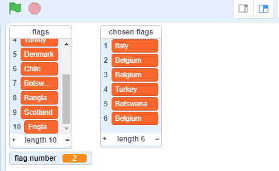

## यादृच्छिक (random) झंडे चुनें

प्रश्नोत्तरी के प्रत्येक दौर के लिए, `flags`{:class="block3variables"} सूची से विकल्पों के रूप में छह यादृच्छिक झंडे चुनें।

--- task ---

`chosen flags`{:class="block3variables"} (चुने गए झंडे) नामक एक और सूची बनाएँ। इस सूची में छह यादृच्छिक झंडे संगृहीत होंगे।

--- /task ---

--- task ---

`flag number`{:class="block3variables"} नामक एक वेरिएबल बनाएँ।

--- /task ---

--- task ---

एक कस्टम ब्लॉक बनाएँ और इसका नाम `choose random flag`{:class="block3myblocks"} (यादृच्छिक झंडे चुनें) रखें।


```blocks3
define choose random flag
```

--- /task ---

--- task ---

`flag number`{:class="block3variables"} वेरिएबल को `1` और `flags`{:class="block3variables"} सूची में आइटमों की संख्या के बीच किसी यादृच्छिक संख्या पर सेट करने के लिए कस्टम ब्लॉक में कोड जोड़ें।


किसी सूची में आइटमों की संख्या खोजने के लिए वेरिएबल टैब में एक विशेष ब्लॉक होता है।

--- hints ---
 --- hint ---

`flag number`{:class="block3variables"} वैरिएबल को एक `flag number`{:class="block3operators"} `1 के बीच` और `length of the 'flags' list` {:class= "block3variables"}।

--- /hint ---

--- hint ---

आपको इस कोड ब्लॉक की ज़रुरत पड़ेगी:

```blocks3
(length of [flags v])

(pick random (1) to (10))

define choose random flag

set [flag number v] to []
```

--- /hint ---

--- hint ---

आपका कोड ऐसा दिखना चाहिए:

```blocks3
define choose random flag
set [flag number v] to (pick random (1) to (length of [flags v]))
```

--- /hint ---

--- /hints --- --- /task ---

यह ब्लॉक सूची में से किसी आइटम को संख्या के अनुसार चुनता है:

```blocks3
(item (10 v) of [flags v])
```

--- task ---

`flags`{:class="block3variables"} सूची में से यादृच्छिक रूप से चुनी गई आइ़टम का पाठ पाने के लिए इस ब्लॉक को `flag number`{:class="block3variables"} के साथ मिलाएँ। फिर उस आइटम के पाठ को `chosen flags`{:class="block3variables"} सूची में जोड़ें। इस कोड को अपने कस्टम ब्लॉक में जोड़ें:


```blocks3
define choose random flag
set [flag number v] to (pick random (1) to (length of [flags v]))
+ add (item (flag number) of [flags v]) to [chosen flags v]
```

--- /task ---

--- task ---

कस्टम `choose random flag`{:class="block3myblocks"} ब्लॉक को उस कोड में जोड़ें जो हरे झंडे को क्लिक करने के बाद चलता है।


```blocks3
when green flag clicked
create flag list :: custom
+ choose random flag :: custom
```

--- /task ---

--- task ---

परीक्षण करें कि हरे झंडे को कई बार क्लिक करने पर आपका कोड काम करता है और जाँच करें कि `chosen flags`{:class="block3variables"} सूची में हर बार विभिन्न देश जोड़े जाते हैं। (यदि आपने सूची छिपा दी है, तो सूची को प्रकट करने के लिए सूची के नाम के आगे बने बॉक्स पर टिक करें।)

--- /task ---

क्या आप यह देख सकते हैं कि यदि आप हरे झंडे को बहुत अधिक बार क्लिक करते हैं, तो आपकी `chosen flags`{:class="block3variables"} सूची शीघ्र ही छह से अधिक आइटमों से भर जाती है?

--- task ---

प्रश्नोत्तरी के लिए छह झंडे चुनने से पहले `chosen flags`{:class="block3variables"} सूची में से सभी आइटमों को हटाने के लिए ब्लॉक जोड़ें।


```blocks3
when green flag clicked
create flag list :: custom
+ delete (all v) of [chosen flags v]
+ repeat (6)
    choose random flag :: custom
end
```

--- /task ---

--- task ---

हरे झंडे को कई बार क्लिक करके अपने कोड का फिर से परीक्षण करें और जाँच करें कि `chosen flags` सूची में हर बार छह देश भरे होते हैं।

--- /task ---

आप देख सकते हैं कि कभी-कभी एक ही देश सूची में एक से अधिक बार जुड़ जाता है।



--- task ---

अपने `choose random flag`{:class="block3myblocks"} ब्लॉक को बदलें ताकि `chosen flags`{:class="block3variables"} सूची में एक ही देश कभी भी दो बार नहीं जुड़े।

`chosen flags`{:class="block3variables"} सूची में `flags`{:class="block3variables"} सूची जोड़े जाने के बाद उसे उसमें से `flag number`{:class="block3variables"} हटाने के लिए अपने कस्टम ब्लॉक कोड के अंत में एक ब्लॉक जोड़ें।


```blocks3
define choose random flag
set [flag number v] to (pick random (1) to (length of [flags v]))
add (item (flag number) of [flags v]) to [chosen flags v]
+ delete (flag number) of [flags v]
```

--- /task ---

यदि आप सूचियों और वेरिएबल को छिपाना चाहते हैं ताकि वे स्टेज पर जगह न लें, तो डेटा खंड में जाएँ और सूची के नामों या वेरिएबल नामों के आगे बने बॉक्सों में चयन को निकाल दें। यदि आप सूचियों और वेरिएबल को फिर से दिखाना चाहते हैं, तो बस बॉक्सों का चयन कर लें।