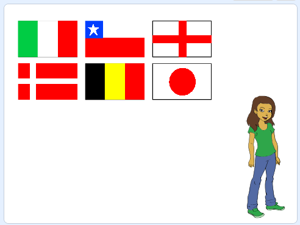

## प्रश्न पूछें

आइए हम खिलाड़ी से किसी देश विशेष के झंडे का नाम बताने के लिए कहें।

\--- task \---

झंडा स्प्राइट (sprite) में, `broadcast the message`{:class="block3events"} झंडे को क्लोन करने वाले ब्लॉक के तुरंत बाद 'देश की घोषणा करें'।


```blocks3
when green flag clicked
create flag list :: custom
delete (all v) of [chosen flags v]
repeat (6)
    choose random flag :: custom
end
set [correct answer v] to (item (pick random (1) to (length of [chosen flags v])) of [chosen flags v])
clone flags :: custom
+ broadcast (announce country v)

```

[[[generic-scratch3-broadcast-message]]]

\--- /task \---

\--- task \---

अपनी क्विज़ मास्टर होने के लिए अपनी पसंद का एक नया स्प्राइट (sprite) जोड़ें। इस उदाहरण में प्रश्नोत्तरी मास्टर एब्बी नामक स्प्राइट है।



\--- /task \---

\--- task \---

क्विज़ मास्टर स्प्राइट में कुछ कोड जोड़ें ताकि जब स्प्राइट ` देश की घोषणा करे ` {:class = "block3events"} प्रसारण, यह खिलाड़ी को उस देश के नाम पर क्लिक करने के लिए कहता है जिसे चर <0 में संग्रहीत किया गया है: सही उत्तर </code> {: class= "block3variables"}।


\--- hints \--- \--- hint \---

` जब मैं ` {:class =" block3events "} प्रसारण प्राप्त करता हूं, ` तो ` {:class = "block3looks"} ` सही उत्तर ` पर क्लिक करें {:class= "block3variables"} '।

\--- /hint \---

\--- hint \---

आपको इस कोड ब्लॉक की ज़रुरत पड़ेगी:

```blocks3
(join [click on] [])

(correct answer)

say [] for (2) seconds

when I receive [announce country v]
```

\--- /hint \---

\--- hint \---

आपका कोड ऐसा दिखना चाहिए:

```blocks3
when I receive [announce country v]
say (join [click on] (correct answer :: variables)) for (2) seconds
```

\--- /hint \---

\--- /hints \--- \--- /task \---