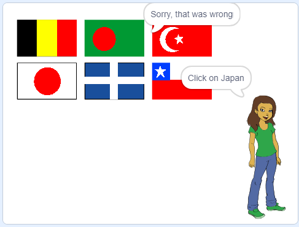

## उत्तर की जाँच करें

आपका स्प्राइट अब खिलाड़ी को सही झंडे पर क्लिक करने के लिए कहता है। फिर गेम को यह जाँचने की ज़रूरत होती है कि जिस झंडे को क्लिक किया गया वह सही उत्तर है या नहीं।

\--- task \---

झंडा स्प्राइट (sprite) कोड पर वापस जाएँ, और कोड का एक नया खंड शुरू करने के लिए एक ब्लॉक जोड़ें जो `when this sprite is clicked`{:class="block3events"} होने पर चलेगा।


\--- /task \---

फिर आपकी प्रश्नोत्तरी को यह जाँच करने की ज़रूरत है कि जिस झंडा स्प्राइट को क्लिक किया गया उसके परिधान का नाम सही उत्तर के समान है या नहीं।

\--- task \---

यदि झंडा स्प्राइट के परिधान का नाम `correct answer`{:class="block3variables"} वेरिएबल के समान है तो 'सही' कहने के लिए, या यदि नाम और वेरिएबल समान नहीं हैं तो 'क्षमा करें, यह गलत था' कहने के लिए कोड जोड़ें।

आप इस उपयोगी ब्लॉक का उपयोग यहाँ भी कर सकते हैं।

```blocks3
(item (10 v) of [flags v])
```

इस बार, वर्तमान झंडा स्प्राइट परिधान का नाम प्राप्त करने के लिए इसे `costume name`{:class="block3looks"} ब्लॉक के साथ जोड़ें।


\--- hints \--- \--- hint \---

` जब यह स्प्राइट क्लिक किया जाता है ` {:class= "ब्लॉक 3 ईवेन्ट्स"}, ` यदि ` {:class = "block3control"} यह ` पोशाक नाम ` {: class = "block3looks"} ` सही उत्तर के बराबर है ` {:class = "block3variables"}, ` कहते हैं ` {} वर्ग = "ब्लॉक 3 एग्जिबिशन"} 'सही', या ` और ` {:class = "block3control"} ` कहना ` {:class =" block3looks "} 'क्षमा करें, वह गलत था'।

\--- /hint \---

\--- hint \---

आपको इस कोड ब्लॉक की ज़रुरत पड़ेगी:

```blocks3
say [Sorry, that was wrong] for (2) seconds

say [Correct] for (2) seconds

if <> then
else
end

(costume [name v])

<[] = []>

(correct answer)

when this sprite clicked
```

\--- /hint \---

\--- hint \---

आपका कोड ऐसा दिखना चाहिए:

```blocks3
when this sprite clicked
if <(costume [name v]) = (correct answer :: variables)> then
    say [Correct] for (2) seconds
else
    say [Sorry, that was wrong] for (2) seconds
end
```

\--- /hint \---

\--- /hints \--- \--- /task \---

\--- task \---

हरे झंडे को दबाएँ और अपने कोड का दो बार परीक्षण करें: एक बार सही झंडा चुनकर, और एक बार गलत झंडा चुनकर। यह जाँच करें कि इस आधार पर सही संदेश दिखाई देता है कि आप सही उत्तर देते हैं या गलत।



\--- /task \---