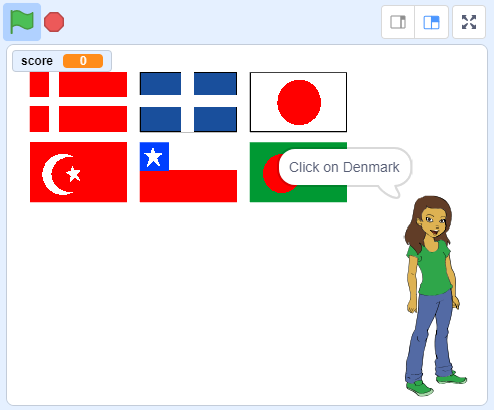

\--- no-print \---

This is the **Scratch 3** version of the project. There is also a [Scratch 2 version of the project](https://projects.raspberrypi.org/en/projects/guess-the-flag-scratch2).

\--- /no-print \---

## 들어가며

In this resource, you will create a flag quiz to test yourself and your friends. In the quiz, six flags and the name of a country are displayed, and you have to click on the correct flag to match the country.

### 만들 작품

\--- no-print \---

Click on the flag of the country for which you are being asked.

  <iframe allowtransparency="true" width="485" height="402" src="https://scratch.mit.edu/projects/embed/276891625/?autostart=false" frameborder="0" scrolling="no"></iframe>

\--- /no-print \---

\--- print-only \---

\--- /print-only \---

## \--- collapse \---

## title: 배우게 될 것

+ How to broadcast a message and have other sprites respond
+ How to select random items from a list

\--- /collapse \---

## \--- collapse \---

## title: 준비물

* * *

### 하드웨어

+ 스크래치 3을 실행할 수 있는 컴퓨터

### 소프트웨어

+ 스크래치 3 ( [온라인](http://rpf.io/scratchon){:target="_ blank"} 또는 [offline](http://rpf.io/scratchoff){:target="_ blank"})

### Downloads

+ [Offline starter project](http://rpf.io/p/en/guess-the-flag-go){:target="_blank"}

\--- /collapse \---

## \--- collapse \---

## title: Additional notes for educators

\--- no-print \---

If you need to print this project, please use the [printer-friendly version](https://projects.raspberrypi.org/en/projects/guess-the-flag/print).

\--- /no-print \---

You can [download the resources for this project here](http://rpf.io/p/en/guess-the-flag-go){:target="_blank"}.

You can find the [completed project here](http://rpf.io/p/en/guess-the-flag-get){:target="_blank"}.

\--- /collapse \---