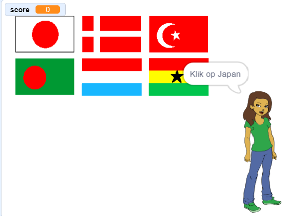

--- no-print ---

Dit is de **Scratch 3** versie van het project. Er is ook een [Scratch 2 versie van dit project](https://projects.raspberrypi.org/nl-NL/projects/guess-the-flag-scratch2).

--- /no-print ---

## Inleiding

In dit project maak je een vlaggenquiz om jezelf en je vrienden te testen. In de quiz worden zes vlaggen en de naam van een land weergegeven, en je moet op de vlag klikken die bij dat land hoort.

### Wat ga je maken

--- no-print ---

Klik op de vlag van het land waarom gevraagd wordt.

  <iframe allowtransparency="true" width="485" height="402" src="https://scratch.mit.edu/projects/embed/385634659/?autostart=false" frameborder="0" scrolling="no"></iframe>

--- /no-print ---

--- print-only ---

--- /print-only ---

--- collapse ---
---
title: Wat ga je leren
---

+ Hoe een bericht te verzenden en andere sprites te laten reageren
+ Hoe willekeurige items uit een lijst te selecteren

--- /collapse ---

--- collapse ---
---
title: Wat heb je nodig
---

### Hardware

+ Een computer die Scratch 3 kan uitvoeren

### Software

+ Scratch 3 ([online](http://rpf.io/scratchon){:target="_blank"} of [offline](http://rpf.io/scratchoff){:target="_blank"})

### Downloads

+ [Offline startproject](http://rpf.io/p/nl-NL/guess-the-flag-go){:target="_blank"}

--- /collapse ---

--- collapse ---
---
title: Aanvullende informatie voor docenten
---

--- no-print ---

Als je dit project wilt afdrukken, gebruik dan de [printervriendelijke versie](https://projects.raspberrypi.org/nl-NL/projects/guess-the-flag/print).

--- /no-print ---

Je kunt [de bronnen voor dit project hier downloaden](http://rpf.io/p/nl-NL/guess-the-flag-go){:target="_blank"}.

Je kunt het [voltooide project hier](http://rpf.io/p/nl-NL/guess-the-flag-get){:target="_blank"} vinden.

--- /collapse ---