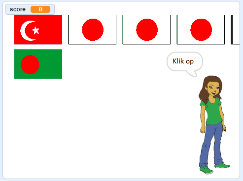

## Begin een nieuwe ronde

Op dit moment is er maar één ronde in de quiz, dus de quiz duurt niet lang. Je gaat meerdere rondes opzetten.

--- task ---

Maak een nieuw `signaal`{:class="block3events"} die het bericht 'Begin het spel' verzendt.


```blocks3
zend signaal (begin het spel v)
```

--- /task ---

--- task ---

Voeg een `wanneer ik signaal 'Begin het spel' ontvang`{:class="block3events"} blok toe en verplaats dan alle code van het `wanneer de op groene vlag wordt geklikt`{:class="block3events"} blok naar de onderkant van dit nieuwe blok.


```blocks3
+ wanneer ik signaal [begin het spel v] ontvang
maak [score v] [0]
maak vlaggenlijst :: custom
verwijder (alle v) van [gekozen vlaggen v]
herhaal (6)
    kies willekeurige vlag :: custom
einde
maak [goed antwoord v] (item (willekeurig getal tussen (1) en (lengte van [gekozen vlaggen v])) van [gekozen vlaggen v])
kloon vlaggen :: custom
+ zend signaal (kondig land aan v)
```

--- /task ---

--- task ---

Verwijder het `maak score 0`{:class="block3variables"} blok en plaats het terug onder het `wanneer op de groene vlag wordt geklikt`{:class="block3control"} blok. Voeg vervolgens het nieuwe blok `zend signaal`{:class="block3events"} onder beide toe.


```blocks3
when flag clicked
maak [score v] [0]
zend signaal (begin het spel v)
```

--- /task ---

--- task ---

Na de code die controleert of het antwoord goed is, voeg je nog een `zend signaal`{:class="block3events"} blok toe zodat een nieuwe ronde kan beginnen zodra een vraag is beantwoord.


```blocks3
wanneer op deze sprite wordt geklikt
als <(uiterlijk [naam v]) = (goed antwoord :: variables)> dan
    verander [score v] met [1]
    zeg [Goed!] (2) sec.
anders
    zeg [Sorry, dat was niet goed] (2) sec.
einde
+ zend signaal (begin het spel v)
```

--- /task ---

--- task ---

Klik op de groene vlag om je code te testen. Klik op een van de vlaggen om een ronde te spelen. Merk je dat de volgende ronde niet goed wordt uitgevoerd?



--- /task ---

Dit komt omdat voordat het spel een nieuwe ronde begint, het spel eerst de gekloonde vlaggen moet opruimen.

--- task ---

Maak nog een nieuw `zend signaal`{:class="block3events"} met de naam 'wissen'.


```blocks3
zend signaal (wissen v)
```

--- /task ---

--- task ---

Stel de vlag sprite in op `verwijder deze kloon`{:class="block3control"} wanneer deze het signaal `wissen`{:class="block3events"} ontvangt.


```blocks3
wanneer ik signaal [wissen v] ontvang
verwijder deze kloon
```

--- /task ---

--- task ---

Plaats het signaalblok `wissen`{:class="block3events"} net boven waar het spel een nieuwe ronde begint nadat een antwoord is gegeven.

```blocks3
wanneer op deze sprite wordt geklikt
maak vlaggenlijst :: custom
als <(item (uiterlijk [nummer v]) van [vlaggen v]) = (goed antwoord: variabelen)> dan
    zeg [Goed!] (2) sec.
    verander [ score v] met [1]
anders
    zeg [Sorry, dat was niet goed] (2) sec.
einde
+ zend signaal (wissen v)
zend signaal (begin het spel v)
```

--- /task ---

--- task ---

Test je code opnieuw en controleer of je meerdere rondes kunt spelen, en dat je score toeneemt naarmate je de juiste antwoorden geeft.

--- /task ---

--- task ---

Zorg ervoor dat je de variabele `goed antwoord`{:class="block3variables"} verbergt, zodat de speler het niet kan zien!

--- /task ---