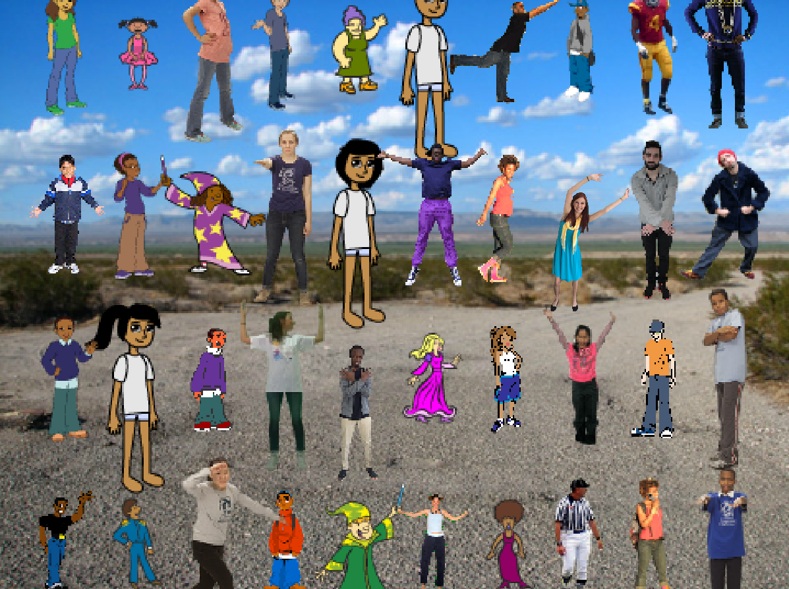

## Wat kun je verder nog doen?

Probeer het [Op een rij](https://projects.raspberrypi.org/nl-NL/projects/lineup?utm_source=pathway&utm_medium=whatnext&utm_campaign=projects) project, waar je een verstoppertje spel maakt en leert hoe je sprites stempelt en coördinaten gebruikt om ze in rijen te plaatsen.

--- no-print ---

Klik op de groene vlag en, zodra het gordijn omhoog is, probeer de sprite te vinden voordat de tijd voorbij is.

  <iframe allowtransparency="true" width="485" height="402" src="https://scratch.mit.edu/projects/embed/385596557/?autostart=false" frameborder="0" scrolling="no"></iframe>

--- /no-print ---

--- print-only ---

Je moet tussen al deze karakters de juiste sprite vinden voordat de tijd voorbij is.

--- /print-only ---

***
Dit project werd vertaald door vrijwilligers:

Sanneke van der Meer

Robert-Jan Kempenaar

Dankzij vrijwilligers kunnen we mensen over de hele wereld de kans geven om in hun eigen taal te leren. Jij kunt ons helpen meer mensen te bereiken door vrijwillig te starten met vertalen - meer informatie op [rpf.io/translate](https://rpf.io/translate).