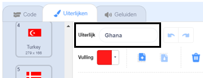

## Teken de vlaggen

--- task ---

Open het 'Raad de vlag' Scratch startproject.

**Online:** open het start project op [rpf.io/guess-the-flag-on](http://rpf.io/guess-the-flag-on){:target="_blank"}. Als je een Scratch account hebt, kun je klikken op **Remix** in de rechterbovenhoek van de online editor om een kopie van het project op te slaan.

**Offline**: open het [startproject](http://rpf.io/p/nl-NL/guess-the-flag-go){:target="_blank"} in de offline editor.

Als je de Scratch offline editor wilt downloaden en installeren dan kan je die vinden op [rpf.io/scratchoff](http://rpf.io/scratchoff){:target="_blank"}.

--- /task ---

Selecteer het tabblad Uiterlijken. Je zou daar acht vlaggen moeten zien.

Blader naar de onderkant van de lijst met uiterlijken, waar er twee lege uiterlijken zijn. Deze uiterlijken zijn er zodat je je eigen vlaggen kunt toevoegen.

--- task ---

Klik op het uiterlijk 'Your flag 1' en wijzig de naam in de naam van een land.

--- /task ---

--- task ---

Teken de vlag van dat land. Zorg ervoor dat je tekening exact dezelfde grootte heeft als het vlaguiterlijk.

Als je geen ideeën hebt, kunt je een aantal vlaggen vinden op [deze 'Flags of the world' webpagina](https://www.countries-ofthe-world.com/flags-of-the-world.html){:target="_blank"}.

--- /task ---

--- task ---

Herhaal dit proces voor het tweede lege vlaguiterlijk zodat er in totaal tien vlaguiterlijken zijn.

--- /task ---

Dit zijn de vlaggen die als voorbeeld dienen in het project 'Raad de vlag', maar je kunt elke gewenste vlag kiezen voor je spel.

