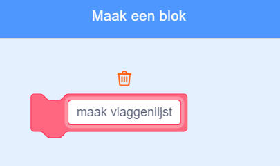

## Maak een lijst met vlaggen

--- task ---

Klik op het tabblad Code. Er is een lijst met de naam `vlaggen`{:class="block3variables"}, waarin je de namen opslaat van de landen waarvoor je spel vlaguiterlijken hebt.

--- /task ---

--- task ---

Voeg nog twee codeblokken toe, één voor de andere twee vlaggen die je hebt gemaakt, dus er zijn in totaal tien blokken die alle tien de landen toevoegen aan de lijst `vlaggen`{:class="block3variables"}.


```blocks3
add [Land] to [vlaggen v]
```

--- /task ---

--- task ---

Klik op de groene vlag en controleer of de landen in de lijst verschijnen.

--- /task ---

Als je meer dan eens op de groene vlag drukt, worden de landen opnieuw aan de lijst toegevoegd en het resultaat is een lijst van 20 landen in plaats van 10.

--- task ---

Voeg aan het begin van de code een blok toe aan `verwijder alle`{:class="block3variables"} van de landen in de lijst voordat je ze toevoegt. Hierdoor worden de landen niet meer dan eens aan de lijst toegevoegd.


```blocks3
when flag clicked
+ delete (alle v) of [vlaggen v]
add [Japan] to [vlaggen v]
add [Belgium] to [vlaggen v]
add [Italy] to [vlaggen v]
add [Turkey] to [vlaggen v]
add [Denmark] to [vlaggen v]
add [Chile] to [vlaggen v]
add [Botswana] to [vlaggen v]
add [Bangladesh] to [vlaggen v]
add [Ghana] to [vlaggen v]
add [Luxembourg] to [vlaggen v]
```

--- /task ---

Maak vervolgens een aangepast blok. Een aangepast blok is een speciaal blok met een naam. Met het aangepaste blok dat je maakt, kun je een lijst met vlaggen maken met alleen dit ene blok in plaats van veel blokken.

--- task ---

Klik op **Mijn blokken** en vervolgens op **Maak een blok**. Noem je aangepaste blok `maak vlaggenlijst`{:class="block3myblocks"}.




--- /task ---

--- task ---

Sleep alle code weg van onder het `wanneer op de groene vlag wordt geklikt`{:class="block3events"} blok en klik het onder het nieuwe `maak vlaggenlijst`{:class="block3myblocks"} blok.

```blocks3
define maak vlaggenlijst
delete (alle v) of [vlaggen v]
add [Japan] to [vlaggen v]
add [Belgium] to [vlaggen v]
add [Italy] to [vlaggen v]
add [Turkey] to [vlaggen v]
add [Denmark] to [vlaggen v]
add [Chile] to [vlaggen v]
add [Botswana] to [vlaggen v]
add [Bangladesh] to [vlaggen v]
add [Ghana] to [vlaggen v]
add [Luxembourg] to [vlaggen v]
```

--- /task ---

--- task ---

Onder het `wanneer op de groene vlag wordt geklikt`{:class="block3events"} blok voeg je het nieuwe `maak vlaggenlijst`{:class="block3myblocks"} blok toe.


```blocks3
when flag clicked
maak vlaggenlijst :: custom
```

--- /task ---