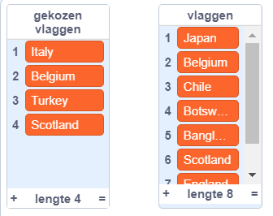

## Kies willekeurige vlaggen

Kies voor elke ronde van de quiz zes willekeurige vlaggen uit de lijst `vlaggen`{:class="block3variables"} als opties.

\--- task \---

Maak een andere lijst met de naam `gekozen vlaggen`{:class="block3variables"}. In deze lijst worden de zes willekeurige vlaggen opgeslagen.

\--- /task \---

\--- task \---

Maak een variabele met de naam `vlag nummer`{:class="block3variables"}.

\--- /task \---

\--- task \---

Maak een aangepast blok en noem het `kies willekeurige vlag`{:class="block3myblocks"}.


```blocks3
definieer kies willekeurige vlag
```

\--- /task \---

\--- task \---

Voeg code toe aan het aangepaste blok om de variabele `vlag nummer`{:class="block3variables"} in te stellen op een willekeurig getal tussen `1` en het aantal items in de lijst met `vlaggen`{:class="block3variables"}.


Er is een speciaal blok in de sectie Variabelen voor het vinden van het aantal items in een lijst.

\--- hints \--- \--- hint \---

Zet de `vlag nummer`{:class="block3variables"} variabele op een `willekeurig getal`{:class="block3operators"} tussen `1` en de `lengte van de 'vlaggen' lijst`{:class="block3variables"}.

\--- /hint \---

\--- hint \---

Dit zijn de codeblokken die je nodig hebt:

```blocks3
(lengte van [vlaggen v])

(willekeurig getal tussen (1) en (10))

definieer kies willekeurige vlag

maak [vlagnummer v] []
```

\--- /hint \---

\--- hint \---

Dit is hoe je code eruit zou moeten zien:

```blocks3
definieer kies willekeurige vlag
maak [vlagnummer v] (willekeurig getal tussen (1) en (lengte van [vlaggen v]))
```

\--- /hint \---

\--- /hints \--- \--- /task \---

Dit blok selecteert een item uit een lijst op nummer:

```blocks3
(item (10 v) van [vlaggen v])
```

\--- task \---

Combineer dit blok met de variabele `vlag nummer`{:class="block3variables"} om de tekst van het willekeurig gekozen item uit de lijst met `vlaggen`{:class="block3variables"} te krijgen. Voeg vervolgens de itemtekst toe aan de lijst `gekozen vlaggen`{:class="block3variables"}. Voeg deze code toe aan je aangepaste blok:


```blocks3
definieer kies willekeurige vlag
maak [vlagnummer v] (willekeurig getal tussen (1) en (lengte van [vlaggen v]))
+ voeg (item (vlagnummer) van [vlaggen v]) toe aan [gekozen vlaggen v]
```

\--- /task \---

\--- task \---

Voeg de aangepaste `kies willekeurige vlag`{:class="block3myblocks"} toe aan de code die wordt uitgevoerd nadat op de groene vlag is geklikt.


```blocks3
wanneer op de groene vlag wordt geklikt
maak vlaggenlijst :: custom
+ kies willekeurige vlag :: custom
```

\--- /task \---

\--- task \---

Test of de code werkt door meerdere keren op de groene vlag te klikken en te controleren of elke keer verschillende landen worden toegevoegd aan de `gekozen vlaggen`{:class="block3variables"} lijst. (Als je de lijst hebt verborgen, vink je het vakje naast de lijstnaam aan om de lijst zichtbaar te maken.)

\--- /task \---

Zie je dat, als je vaak op de groene vlag klikt, je `gekozen vlaggen`{:class="block3variables"} lijst snel vol raakt met meer dan zes items?

\--- task \---

Voeg blokken toe om alle items uit de lijst `gekozen vlaggen`{:class="block3variables"} te verwijderen voordat je zes vlaggen voor de quiz kiest.


```blocks3
wanneer op de groene vlag wordt geklikt
maak vlaggenlijst :: custom
+ verwijder (alle v) van [gekozen vlaggen v]
+ herhaal (6)
    kies willekeurige vlag :: custom
einde
```

\--- /task \---

\--- task \---

Test je code opnieuw door meerdere keren op de groene vlag te klikken en te controleren of de lijst `gekozen vlaggen` telkens met zes landen wordt gevuld.

\--- /task \---

Je merkt misschien dat hetzelfde land meer dan eens aan de lijst wordt toegevoegd.



\--- task \---

Wijzig het `kies willekeurige vlag`{:class="block3myblocks"} blok zodat hetzelfde land nooit twee keer wordt toegevoegd aan de `gekozen vlaggen`{:class="block3variables"} lijst.

Voeg een blok toe aan het einde van de aangepaste blokcode om het `vlag nummer`{:class="block3variables"} te verwijderen uit de lijst met `vlaggen`{:class="block3variables"} nadat deze is toegevoegd aan de `gekozen vlaggen`{:class="block3variables"} lijst.


```blocks3
definieer kies willekeurige vlag
maak [vlagnummer v] (willekeurig getal tussen (1) en (lengte van [vlaggen v]))
voeg (item (vlagnummer) van [vlaggen v]) toe aan [gekozen vlaggen v]
+ verwijder (vlagnummer) van [vlaggen v]
```

\--- /task \---

Als je de lijsten en variabelen wilt verbergen zodat ze geen ruimte in het werkgebied innemen, ga je naar de sectie Variabelen en vink je de vakjes naast de namen van de lijsten of variabelen uit. Als je de lijsten en variabelen opnieuw wilt weergeven, vink je de vakjes weer aan.